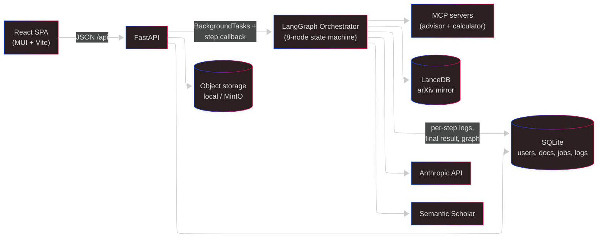
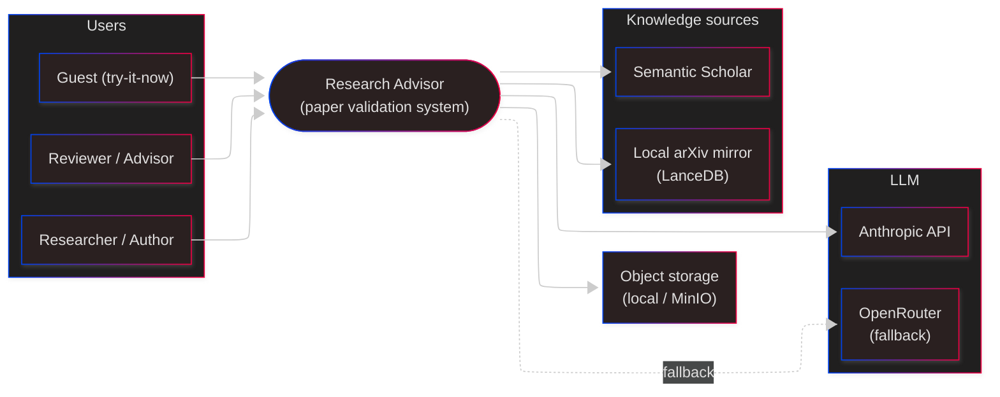
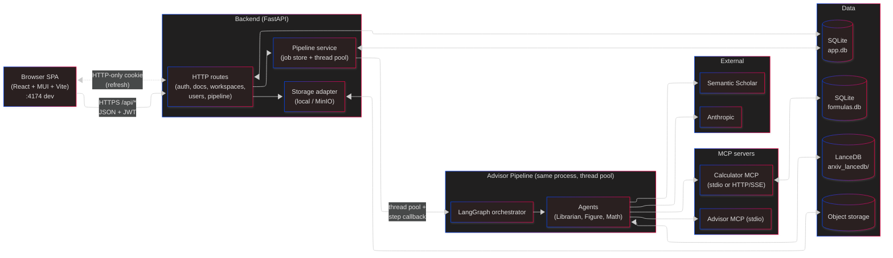
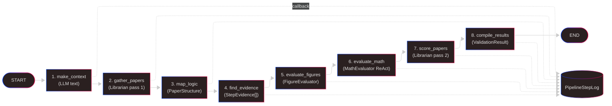
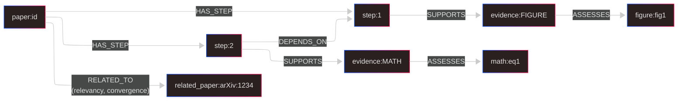
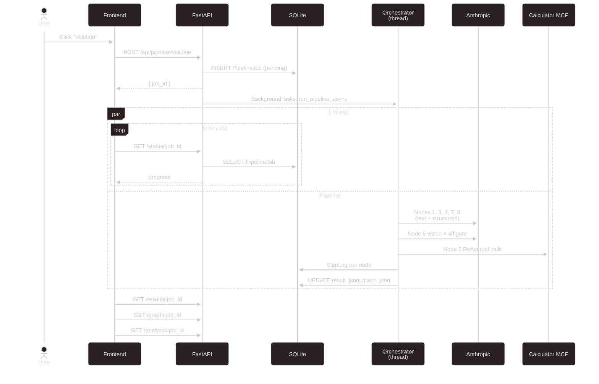
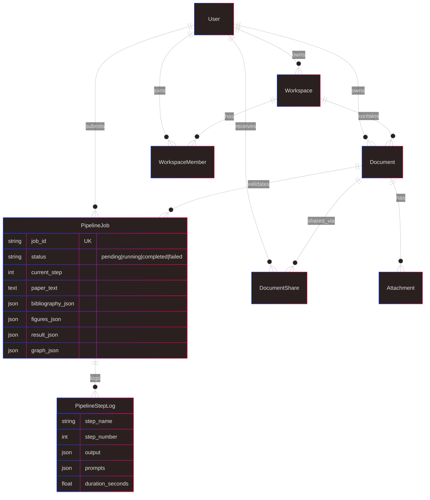
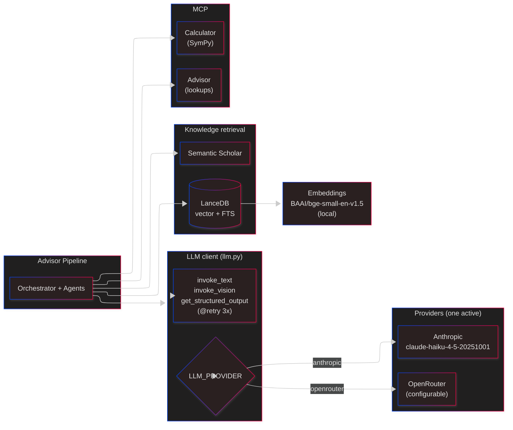
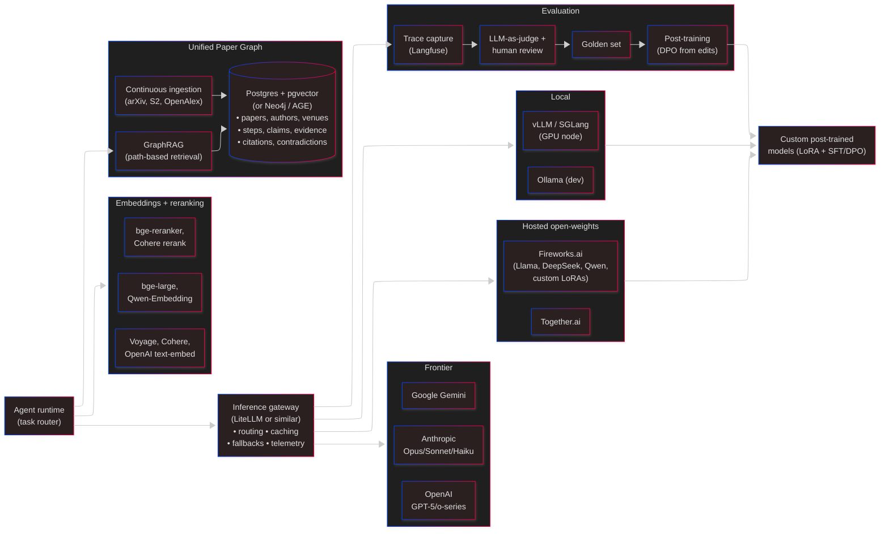

# Research Advisor — Architecture

A pre-alpha multi-agent system for validating scientific papers. Users paste paper text + figures + bibliography; an 8-step pipeline analyzes logical structure, verifies math (SymPy via MCP), finds related work (LanceDB + Semantic Scholar), evaluates figures (vision models), and emits a confidence-scored review plus an auditable evidence graph.

This is a single-file architecture doc for a one-sitting review. It progresses from coarsest to finest. Every section ends with open questions — push back on any of them.

---

## Contents

1. [Summary](#summary)
2. [System context](#system-context)
3. [Containers](#containers)
4. [Pipeline internals](#pipeline-internals)
5. [Data model](#data-model)
6. [AI stack — current and future](#ai-stack--current-and-future)
7. [Known issues](#known-issues)
8. [Future shape](#future-shape)
9. [The biggest open questions](#the-biggest-open-questions)

---

## Summary



**One sentence:** A React SPA talks to a FastAPI backend that runs a LangGraph pipeline of LLM-backed agents, which use MCP tools and a local arXiv mirror to produce a validation report + an auditable NetworkX graph of every claim and piece of evidence.

### Stack

| Layer       | Tech                                                                                     |
| ----------- | ---------------------------------------------------------------------------------------- |
| Frontend    | React 18 + TypeScript + MUI v5 + Vite + react-router v6 + Axios                          |
| Backend     | FastAPI + SQLModel + SQLite                                                              |
| Pipeline    | LangGraph + LangChain + Anthropic SDK                                                    |
| AI / LLM    | Anthropic `claude-haiku-4-5-20251001` (default); OpenRouter fallback; `tenacity` retries |
| MCP         | `mcp` Python SDK — stdio for advisor; stdio or HTTP/SSE for calculator                   |
| Knowledge   | LanceDB (vector + FTS, `BAAI/bge-small-en-v1.5` embeddings)                              |
| Storage     | Local FS or MinIO (S3-compatible)                                                        |
| Build / dev | Vite, uvicorn, `scripts/start-dev.{sh,bat}`, Makefile, Docker Compose                    |

### Glossary

- **Orchestrator** — LangGraph `StateGraph` in [advisor_pipeline/orchestrator.py](../advisor_pipeline/orchestrator.py). 8 sequential nodes.
- **Agent** — Python class encapsulating one kind of validation: `Librarian`, `FigureEvaluator`, `MathEvaluator`.
- **MCP server** — Local process exposing tools via the Model Context Protocol. Two: `advisor_server` (prompts + lookups), `calculator_server` (SymPy solver).
- **Paper graph** — NetworkX `DiGraph` built during the pipeline. Typed nodes (paper, step, evidence, figure, math, related_paper) and typed edges. Serialized as JSON on the `PipelineJob` row.
- **PipelineJob / PipelineStepLog** — SQLite rows. Job holds inputs and final outputs; StepLog is one row per orchestrator node.

---

## System context

The outermost view: who uses the system and what it depends on.



### Trust boundaries

- **Browser ↔ Backend**: JWT (15-min access) + HTTP-only refresh cookie (7d, rotated). CORS fully open — flagged.
- **Backend ↔ LLM providers**: API keys in backend env only. No client-side LLM calls.
- **Backend ↔ Semantic Scholar**: Unauthenticated public API; no user data sent.
- **Backend ↔ MCP servers**: Local processes (stdio) or localhost HTTP/SSE. No network exposure.

### Open questions

- Is "paste a paper, get a review" the right primary interaction, or should uploads + workspace-scoped validation be first-class?
- How core is the arXiv mirror? Could we start with Semantic Scholar only?
- Is the reviewer persona the paper's author or a third-party advisor? Current UI leans author; the auditable graph leans reviewer.

---

## Containers

One level inside the black box: deployable units and the protocols between them.



### Containers at a glance

| Container        | Tech                  | Owns                          | Talks to                                              |
| ---------------- | --------------------- | ----------------------------- | ----------------------------------------------------- |
| Browser SPA      | React 18 + MUI + Vite | UI state (Context + local)    | Backend (HTTPS)                                       |
| Backend          | FastAPI + SQLModel    | SQLite, pipeline jobs         | Pipeline (in-proc), storage, Anthropic (via pipeline) |
| Advisor Pipeline | LangGraph + LangChain | State machine for validation  | MCP, Anthropic, LanceDB, Semantic Scholar             |
| Advisor MCP      | MCP stdio server      | 12 prompts + 5 lookup tools   | Semantic Scholar, local files                         |
| Calculator MCP   | MCP stdio / HTTP-SSE  | SymPy formula DB              | formulas.db                                           |
| SQLite `app.db`  | File                  | Users, docs, workspaces, jobs | —                                                     |
| LanceDB          | Embedded vector DB    | arXiv papers (vector + FTS)   | —                                                     |
| Object storage   | FS or MinIO           | Figures, attachments          | —                                                     |

### Key communication patterns

1. **Frontend → Backend**: JSON over HTTP. Axios auto-refreshes access tokens on 401. Vite dev proxy handles CORS in dev.
2. **Backend → Pipeline**: in-process thread pool. `POST /api/pipeline/validate` inserts a `PipelineJob`, then spawns `AdvisorOrchestrator.run()` via FastAPI `BackgroundTasks`. Frontend polls `/status/:jobId` every 2s.
3. **Pipeline → MCP**: language-model tool-use protocol. Calculator MCP runs as a daemon-threaded asyncio loop wrapped by a sync facade (LangGraph is sync).
4. **Per-step callback**: after each LangGraph node, a callback writes a `PipelineStepLog` row with outputs, prompts, and duration. This is what makes the pipeline auditable.

### Deployment today

- **Dev**: `scripts/start-dev.{sh,bat}` runs Vite on :4174 proxying to uvicorn on :8070. Pipeline is in-process; MCP servers are stdio children.
- **Docker**: `docker/` has CPU + GPU compose profiles ([python.Dockerfile](../docker/python.Dockerfile), [frontend.Dockerfile](../docker/frontend.Dockerfile)). Makefile wraps common targets (`make dev`, `make dev-gpu`, `make up`).

### Where coupling lives

- **Pipeline is embedded, not a service.** Same Python process as the backend. Pros: no RPC, shared venv. Cons: can't scale pipeline workers independently, a pipeline crash can take down request serving.
- **`PipelineJob.result_json` and `graph_json` are the API contract.** Frontend parses markdown out of `result_json.overall_assessment.review`. Already flagged as something to replace with structured JSON.
- **MCP servers are launched by the pipeline process.** Stdio = one-child-per-pipeline-instance. If we split the pipeline into a worker, we have to decide whether MCP lives with it or becomes its own service.

### Open questions

- Should the pipeline be a separate worker (Celery / RQ / Arq) to isolate failures and allow horizontal scaling?
- Is markdown-through-JSON going to bite us once we want to render sections independently, filter, or localize?
- Do we need LanceDB in-process, or would a dedicated vector service (pgvector, Qdrant) simplify ops?
- CORS is fully open and `/users/search` requires no auth. Both are probably not the right defaults for launch.

---

## Pipeline internals

The 8-node LangGraph state machine. Each node reads from and writes to `AdvisorState` (a TypedDict). Between nodes, a callback persists progress to SQLite for the UI to poll.

### The graph



### What each node does

| #   | Node               | Writes to `AdvisorState`                         | External calls                           |
| --- | ------------------ | ------------------------------------------------ | ---------------------------------------- |
| 1   | `make_context`     | `paper_context`                                  | Anthropic text                           |
| 2   | `gather_papers`    | `librarian_result`, `related_papers`             | LanceDB (FTS + vector), Semantic Scholar |
| 3   | `map_logic`        | `paper_structure` (steps + claims)               | Anthropic structured → `PaperStructure`  |
| 4   | `find_evidence`    | `step_evidence`, initial `paper_graph`           | Anthropic structured → `StepEvidence`    |
| 5   | `evaluate_figures` | `figure_evaluations`, updates `paper_graph`      | Anthropic vision × 4 per figure          |
| 6   | `evaluate_math`    | `math_evaluations`, updates `paper_graph`        | Calculator MCP + Anthropic               |
| 7   | `score_papers`     | scored `librarian_result`, updates `paper_graph` | Anthropic structured per paper           |
| 8   | `compile_results`  | `validation_result`                              | Anthropic structured → `OverAllReview`   |

Source: [advisor_pipeline/orchestrator.py](../advisor_pipeline/orchestrator.py).

### Agents

- **FigureEvaluator** ([figure_evaluator.py](../advisor_pipeline/agents/figure_evaluator.py)) — four vision calls per figure: describe actual, describe expected, compare, assess claims.
- **MathEvaluator** ([math_evaluator.py](../advisor_pipeline/agents/math_evaluator.py)) — LangGraph ReAct agent over Calculator MCP tools. Verifies equations with ±500 char context extraction.
- **Librarian** ([librarian.py](../advisor_pipeline/agents/librarian.py)) — Two passes. Pass 1 (`gather_papers`): FTS + vector + Semantic Scholar fallback. Pass 2 (`score_papers`): LLM scores each paper for `relevancy ∈ [0,1]` and `convergence ∈ [-1,+1]`.

### MCP integration

Two servers:

- **Advisor MCP** ([mcp_servers/advisor_server/](../advisor_pipeline/mcp_servers/advisor_server/)) — stdio. 12 prompt templates + 5 tools (`load_paper`, `search_semantic_scholar`, `get_paper_abstract`, `check_paper_accessibility`, `extract_doi`).
- **Calculator MCP** ([mcp_servers/calculator_server/](../advisor_pipeline/mcp_servers/calculator_server/)) — stdio or HTTP/SSE. 4 tools (`calculate`, `verify`, `list_formulas`, `describe_formula`). SQLite formula table with SymPy solver.

**Why a sync wrapper?** The MCP Python SDK is async; LangGraph is sync. [CalculatorClient](../advisor_pipeline/mcp_client.py) runs an asyncio loop in a daemon thread and exposes blocking methods.

### The paper graph — the auditable output

Built by `find_evidence`, enriched by evaluation nodes. NetworkX `DiGraph` with typed nodes and edges. See [models/paper_graph.py](../advisor_pipeline/models/paper_graph.py).



Query helpers on the graph: `get_contradicted_steps`, `get_invalid_math`, `get_librarian_statistics`, `get_figure_confirmation_counts`, `get_steps_with_no_evidence`, `get_high_impact_papers`.

### Runtime sequence — submit → poll → render



### Failure modes

| Failure                       | Current behavior                              | Should be                                      |
| ----------------------------- | --------------------------------------------- | ---------------------------------------------- |
| Anthropic call fails          | `@retry` 3× exp; else job `failed` with stack | OK; consider circuit breaker for outages       |
| MCP calculator unreachable    | Tool call raises; step fails                  | Graceful fallback: mark math `is_valid=None`   |
| Process restart mid-run       | Job stuck at `running` forever                | Durable queue + claim/ack or startup sweeper   |
| Figures exceed vision context | Vision call truncates or errors               | Pre-flight size check, downscale before upload |

### Open questions

- Is the strict linear 8-node graph right, or should some steps fan out (one node per figure, one per step) for parallelism? LangGraph supports parallel branches — we're not using them.
- Per-figure vision does 4 LLM calls; a 10-figure paper is 40 calls serialized. Batching / parallel dispatch would help latency a lot.
- Math extraction with ±500 char context is heuristic — do we want a proper math parser (e.g., `unified-latex`)?
- Is 2-second polling right, or should we push SSE updates?

---

## Data model

Everything persisted to SQLite. The Pydantic schemas in [advisor_pipeline/models/schemas.py](../advisor_pipeline/models/schemas.py) are self-documenting — not reproduced here.



### Key decisions

- **`PipelineJob` stores inputs _and_ outputs.** Fully reconstructable from its row — nice for reruns and debugging.
- **`PipelineStepLog` per node** gives the audit trail.
- **`graph_json`** is NetworkX node-link format; the backend rebuilds the `DiGraph` on demand for analysis queries.
- **`figures_json`** is `{figure_name: {base64, media_type}}` — figures inlined as base64 inside the job row. Object storage holds the _original_ attachments on `Document`; the pipeline gets a materialized copy.

### Issues

- **`figures_json` as base64 inside the row** balloons SQLite rows. For larger papers, store refs to object storage instead.
- **No migrations.** `SQLModel.metadata.create_all()` creates missing tables but doesn't evolve existing ones. Need Alembic before users have data we can't drop.
- **No soft delete** — hard deletes throughout. Fine now; add `deleted_at` when we have shared documents people can't afford to lose.

### Open questions

- SQLite → Postgres timing. When does the single-writer bottleneck hurt?
- Cap / truncate `PipelineStepLog.output`? It holds whole state deltas and can be large.

---

## AI stack — current and future

The AI-specific parts isolated. This layer can evolve without most of the product-level code changing.

### Current



**Characteristics:**

- **Single provider at a time** (`LLM_PROVIDER` switch). No per-task routing.
- **Haiku by default.** Cheap, fast, good enough for structured output + vision.
- **No caching** — prompt, result, or embedding. Every run redoes every call.
- **No evals.** No ground truth; regressions are invisible.
- **Isolated per-run graph.** Every submission produces its own NetworkX graph. No cross-paper accumulation.

**Good at:** shipping a prototype cheaply, provider portability (gateway-ready), auditability (every call flows through `llm.py`).

**Bad at:** cost scaling (no caching), quality ceiling (one model for all tasks), knowledge isolation (each paper stands alone).

### Future

Mixture of local, hosted-open, and frontier models, each routed to tasks they're best at, plus a unified knowledge graph accumulating across every paper.



**Key changes from today:**

1. **Inference gateway** (LiteLLM or in-house). One place for routing, caching, fallbacks, cost caps, telemetry. Makes per-task model selection safe.

2. **Mixture of models, routed per task.** Plausible routing:

   | Task                            | Future model                                         |
   | ------------------------------- | ---------------------------------------------------- |
   | Context summarization           | Local Llama-3.1-8B (cheap)                           |
   | Logic / evidence extraction     | Sonnet or custom post-trained 8–14B                  |
   | Figure vision                   | Sonnet for assessment + Llama-Vision for description |
   | Math ReAct                      | Opus or o-series (reasoning-heavy)                   |
   | Librarian scoring (batch)       | Llama-70B via Fireworks (~10x cheaper than frontier) |
   | Final compilation (user-facing) | Sonnet                                               |
   | Embeddings                      | bge-large local + Voyage for high-value queries      |

3. **Hosted open-weights** (Fireworks / Together) for cost-at-volume + fine-tuning pipeline. Lead with Fireworks, keep Together warm as second source.

4. **Custom post-trained models** — LoRAs hosted on Fireworks. Candidates: claim extraction (8–14B SFT), figure claim-assessment vision fine-tune, DPO from reviewer edits. No in-house GPU cluster.

5. **Local inference** — vLLM on a single GPU for latency-tolerant tasks; Ollama for dev.

6. **Unified Paper Graph** — the big one. Today: every run produces an isolated NetworkX graph. Future: they merge into one global typed graph that accumulates across every paper ingested.

   **Schema:**
   - Nodes: `paper`, `author`, `venue`, `topic`, `step`, `claim`, `evidence`, `figure`, `equation`, `concept`, `assertion`, `rebuttal`.
   - Edges: `CITES`, `AUTHORED_BY`, `PUBLISHED_IN`, `ABOUT`, `HAS_STEP`, `DEPENDS_ON`, `SUPPORTS`, `CONTRADICTS`, `EXTENDS`, `REPLICATES`, `MENTIONS`.
   - Properties: confidence, provenance (agent / model / prompt hash), timestamps, embeddings on semantic nodes.

   **Where it lives:** Postgres + pgvector + adjacency tables to start; Neo4j or Apache AGE only if queries demand it. Don't lead with Neo4j — ops cost unjustified at alpha.

   **Ingestion:** arXiv firehose, Semantic Scholar bulk dump, OpenAlex, plus every user-submitted paper's validation graph.

   **What this unlocks:** cross-paper contradiction detection, citation-neighborhood retrieval, provenance queries ("show me every validation where Haiku figure agent contradicted the claim"), GraphRAG that walks typed edges instead of just cosine similarity.

7. **Evaluation + feedback loop** — golden set (retracted papers, known-good papers, known math errors), LLM-as-judge per node in CI, trace capture (Langfuse / Phoenix), reviewer edits feeding post-training.

**What we're betting on:**

- **MCP as the tool-use standard.**
- **Hosted inference over self-hosted frontier.** Ops focus on the graph + product, not GPUs.
- **The graph is the moat.** Anyone can call Claude; not everyone has a purpose-built, continuously-ingested, typed knowledge graph of the literature.
- **Task-level post-training beats prompting frontier models** once reviewer edits accumulate.

### Open questions (AI)

- **Gateway: LiteLLM vs. OpenRouter-as-gateway vs. in-house?**
- **Graph DB: Postgres+pgvector vs. Neo4j vs. AGE?** Defer until query patterns are clear.
- **Evals first or gateway first?** I'd vote evals — without them, routing / swapping is blind.
- **Fine-tune embeddings too?** Often the biggest retrieval win. Cheap. Worth piloting.
- **How public is the unified graph?** Internal-only, or a product surface (explore related work independent of validation)?
- **Multi-tenant isolation.** Private workspace papers must not merge into the public global graph without consent.

---

## Known issues

All of these are tracked and acknowledged — we're not hiding them.

| Issue                                                    | Severity | Planned response                              |
| -------------------------------------------------------- | -------- | --------------------------------------------- |
| CORS fully open (`allow_origins=["*"]`)                  | High     | Lock to known origins before launch           |
| `/users/search` has no auth requirement                  | High     | Add `get_current_user_id` dependency          |
| In-process pipeline; no durable queue                    | High     | Extract to worker before launch               |
| SQLite for jobs + users                                  | Medium   | Migrate to Postgres + Alembic                 |
| Markdown inside `result_json.overall_assessment.review`  | Medium   | Emit structured JSON (tracked in `CLAUDE.md`) |
| No rate limiting on `/pipeline/validate`                 | Medium   | Per-user limit + monthly cap                  |
| No structured logs / metrics / tracing                   | Medium   | OpenTelemetry + Loki or Datadog               |
| Secrets in `.env`                                        | Medium   | Managed secret store                          |
| Serial figure / math evaluation                          | Low      | Parallelize with LangGraph branches           |
| Dead deps (`draft-js`, `katex`, `zustand`, `instructor`) | Low      | Remove                                        |

---

## Future shape

Three plausible futures for after pre-alpha. Not a commitment — concrete options the architect can push back on or combine.

### A) Minimal-lift launch

Keep the current architecture almost verbatim. Fix known issues, harden security, add observability. Extract pipeline into a worker behind a queue; SQLite → Postgres; CORS locked; `/users/search` auth'd; MCP Calculator as an SSE service.

**Trade-offs:** Ships fast. Doesn't solve latency (serial pipeline) or extensibility (hard to add new agents / interfaces).

### B) Multi-interface, agent-first

Reshape around the product story: multiple interfaces (web, extension, mobile, Drive), a unified API, a general-purpose router agent that dispatches to specialists, pluggable MCP servers. LangGraph orchestrator becomes a router; Logic/Math/Figure/Librarian become tool-using agents behind the same MCP abstraction. Explicit human-in-the-loop primitives.

**Trade-offs:** Bigger lift. More moving parts. Router-agent reliability is a real concern. Latency could _improve_ if specialists run in parallel.

### C) Graph-native, evidence-first

Take seriously that the paper graph **is** the product. Build around incremental graph construction, with agents as producers/consumers of typed graph nodes, and the UI as a graph editor. The rigid 8-step linear pipeline goes away — event-driven agents subscribing to graph changes. Reruns become cheap: invalidate one node, replay only what depends on it.

**Trade-offs:** Biggest rewrite. Highest conceptual clarity if it works. Graph editors are hard to build well. Consistency/race-condition risk across agents writing to the same graph.

### How to decide

| Question                                             | Pushes toward                 |
| ---------------------------------------------------- | ----------------------------- |
| "Is validation a one-shot or a workflow?"            | One-shot → A; workflow → B/C  |
| "Do users want to edit the evidence graph?"          | Yes → C                       |
| "Do we want an extension / Drive integration in v1?" | Yes → B                       |
| "Engineering budget for launch?"                     | Low → A; medium → B; high → C |
| "Is the graph a byproduct or the product?"           | Product → C                   |

### Things that don't change across all three

- **The LLM boundary.** Anthropic-via-LangChain + MCP tools is a good bet regardless of shape.
- **The evidence taxonomy.** Typed nodes/edges (step, evidence, figure, math, related_paper) are worth keeping.
- **Per-step auditability.** Wherever reasoning happens, we should be able to show what was sent, what came back, why the conclusion was reached.
- **Pluggable knowledge sources.** The Librarian abstraction shouldn't care if it's LanceDB, Qdrant, Semantic Scholar, or OpenAlex underneath.

---

## The biggest open questions

Ordered by impact on future architecture:

1. **Is the product a validation report, or a living evidence graph?** This single answer determines whether we stay near option A, evolve to B, or commit to C.
2. **Should the pipeline be rethought as a router + specialists** instead of a strict 8-step linear graph? Parallelism + extensibility vs. predictability.
3. **Postgres + durable queue + worker extraction before launch** — worth the upfront cost, or ship on SQLite and migrate later?
4. **Which interfaces are in v1?** Web only, or browser extension / Drive integration too?
5. **Graph persistence shape** — keep NetworkX-as-JSON, or move to a real graph-ish store (Postgres adjacency, Neo4j, AGE)?
6. **Human-in-the-loop primitives** — should the API support "pause-and-ask" workflows, or stay one-shot?
7. **Inference gateway before or after evals?** I lean evals-first; without them, routing is blind.

### What we're _not_ asking help on (to save your time)

- Python 3.12 + FastAPI + SQLModel — we like them.
- React 18 + MUI + Vite — we like them.
- Anthropic as primary LLM — decided, cost/quality fit.
- MCP as the tool-use protocol — decided, worth the bet.
- LangGraph over hand-rolled orchestration — decided, but open to revisiting if it gets in the way.

---

## Repo layout

```
research_agent/
├── frontend/               # React SPA
├── backend/                # FastAPI app
│   └── app/
│       ├── routes/         # auth, documents, workspaces, users, pipeline
│       ├── services/       # pipeline_service.py (job store, thread pool)
│       ├── models.py       # SQLModel entities
│       ├── security.py     # JWT + bcrypt + cookies
│       ├── storage.py      # local FS / MinIO abstraction
│       └── main.py         # app entrypoint
├── advisor_pipeline/       # LangGraph pipeline
│   ├── orchestrator.py     # 8-node StateGraph
│   ├── llm.py              # ChatAnthropic + helpers
│   ├── mcp_client.py       # sync wrapper for Calculator MCP
│   ├── agents/             # Librarian, FigureEvaluator, MathEvaluator
│   ├── models/             # schemas.py + paper_graph.py
│   ├── mcp_servers/
│   │   ├── advisor_server/ # 12 prompts + 5 tools (stdio)
│   │   └── calculator_server/  # 4 tools (stdio or HTTP/SSE) + formulas.db
│   └── config/settings.py  # Pydantic settings
├── docker/                 # Dockerfiles + compose
├── scripts/                # start-dev.{sh,bat}, setup-dev.{sh,bat}
├── docs/
│   └── ARCHITECTURE.md     # this file
├── makefile                # 60+ targets
├── pyproject.toml          # advisor_pipeline as editable package
└── CLAUDE.md               # project overview + conventions
```

---

## Tech stack reference

The same stack the [Summary](#stack) table sketches, broken out by section.

### Frontend

| Component      | Tech                                                         |
| -------------- | ------------------------------------------------------------ |
| Language       | TypeScript 5                                                 |
| UI framework   | React 18                                                     |
| Build / dev    | Vite 5 (port 4174 in dev)                                    |
| Component lib  | MUI v5 (`@mui/material`, `@mui/icons-material`, `@mui/lab`)  |
| Styling        | Emotion (`@emotion/react`, `@emotion/styled`)                |
| Routing        | react-router-dom v6                                          |
| HTTP client    | Axios (with auto token refresh interceptors)                 |
| State          | React Context (auth, dialogs, theme) + page-level `useState` |
| Markdown       | `react-markdown` + `remark-gfm`                              |
| Math rendering | KaTeX                                                        |
| Graph viz      | `react-force-graph-2d`                                       |
| Mock mode      | `axios-mock-adapter` (via `npm run dev:mock`)                |
| Linting        | ESLint + `@typescript-eslint` + `eslint-plugin-react-hooks`  |

### Backend

| Component      | Tech                                                                         |
| -------------- | ---------------------------------------------------------------------------- |
| Language       | Python 3.12 (project requires `>=3.11`)                                      |
| Web framework  | FastAPI                                                                      |
| ASGI server    | uvicorn (port 8070 in dev)                                                   |
| ORM / models   | SQLModel (SQLAlchemy + Pydantic)                                             |
| Database       | SQLite (`app.db`)                                                            |
| Validation     | Pydantic v2 + `pydantic-settings`                                            |
| Auth           | `python-jose` (HS256 JWT) + `bcrypt` (passwords) + HTTP-only refresh cookies |
| Object storage | Local filesystem or MinIO (S3-compatible) via `STORAGE_BACKEND` env          |
| Multipart      | `python-multipart`                                                           |
| Timezone       | `tzdata` (`America/Los_Angeles`)                                             |
| Linting        | Ruff (line length 100, target py311)                                         |

### Advisor pipeline (AI / orchestration)

| Component         | Tech                                                                 |
| ----------------- | -------------------------------------------------------------------- |
| Orchestration     | LangGraph `StateGraph` (8 sequential nodes)                          |
| LLM framework     | LangChain (`langchain`, `langchain-anthropic`, `langchain-core`)     |
| Primary LLM       | Anthropic `claude-haiku-4-5-20251001` (default)                      |
| Alternate LLM     | OpenRouter (any model ID), toggled via `LLM_PROVIDER`                |
| Anthropic SDK     | `anthropic` (used directly + via LangChain)                          |
| Structured output | `ChatAnthropic.with_structured_output(PydanticModel)`                |
| Vision            | `ChatAnthropic.invoke` with image content blocks (4 calls/figure)    |
| Tool-use protocol | MCP — `mcp` Python SDK (stdio + HTTP/SSE transports)                 |
| Math solver       | SymPy (inside Calculator MCP server)                                 |
| Math agent        | LangGraph ReAct agent (over Calculator MCP tools)                    |
| Retries           | `tenacity` (`@retry`, 3 attempts, exponential backoff)               |
| HTTP              | `httpx` (Semantic Scholar + citation lookups)                        |
| Graph (in-memory) | NetworkX `DiGraph` (typed nodes/edges; serialized as node-link JSON) |
| Graph viz (debug) | `pyvis`                                                              |

### Knowledge & retrieval

| Component        | Tech                                                          |
| ---------------- | ------------------------------------------------------------- |
| Vector + FTS DB  | LanceDB (hybrid vector similarity + full-text)                |
| FTS engine       | `tantivy` (LanceDB's FTS backend)                             |
| Embeddings       | `BAAI/bge-small-en-v1.5` via LanceDB's `huggingface` registry |
| ML runtime       | `transformers` (Hugging Face)                                 |
| External search  | Semantic Scholar API (unauthenticated)                        |
| Calculator store | SQLite (`formulas.db`) + SymPy formula table                  |

### Data stores

| Store            | Technology             | Holds                                                         |
| ---------------- | ---------------------- | ------------------------------------------------------------- |
| `app.db`         | SQLite via SQLModel    | Users, documents, workspaces, attachments, jobs, step logs    |
| `formulas.db`    | SQLite                 | Calculator MCP formula table (incl. `ml_validation` formulas) |
| `arxiv_lancedb/` | LanceDB (embedded)     | arXiv papers (vector + FTS) for the Librarian agent           |
| Object storage   | Local FS or MinIO (S3) | Figures and document attachments                              |

### Build, dev, deploy

| Component         | Tech                                                              |
| ----------------- | ----------------------------------------------------------------- |
| Frontend build    | Vite + `@vitejs/plugin-react` + `tsc`                             |
| Backend packaging | `pyproject.toml` (advisor_pipeline as editable install)           |
| Backend deps      | `backend/requirements.txt`                                        |
| Containerization  | Docker — `docker/python.Dockerfile`, `docker/frontend.Dockerfile` |
| Compose profiles  | CPU + GPU dev/prod via `docker-compose`                           |
| Task runner       | GNU Make (60+ targets — `make dev`, `make dev-gpu`, `make up`, …) |
