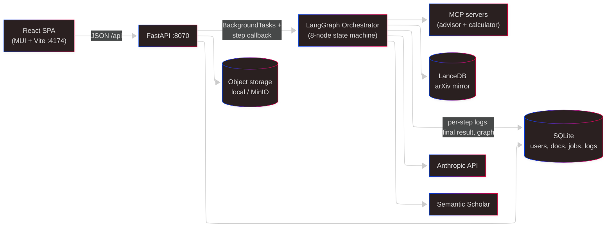

# Research Advisor — Architecture

A pre-alpha multi-agent system for validating scientific papers. Users paste paper text + figures + bibliography; an 8-step pipeline analyzes logical structure, verifies math (SymPy via MCP), finds related work (LanceDB + Semantic Scholar), evaluates figures (vision models), and emits a confidence-scored review plus an auditable evidence graph.

This document is the entry point for an architectural review. It gives the 60-second summary, a glossary, an index of diagrams at progressively finer granularity, and the list of questions we'd most value outside input on.

---

## 60-second summary



**One sentence:** A React SPA talks to a FastAPI backend that runs a LangGraph pipeline of LLM-backed agents, which use MCP tools and a local arXiv mirror to produce a validation report + an auditable NetworkX graph of every claim and piece of evidence.

## Stack

| Layer            | Tech                                                              |
| ---------------- | ----------------------------------------------------------------- |
| Frontend         | React 18 + TypeScript + MUI v5 + Vite + react-router v6 + Axios   |
| Backend          | FastAPI + SQLModel + SQLite                                        |
| Pipeline         | LangGraph + LangChain + Anthropic SDK                              |
| MCP              | `mcp` Python SDK — stdio for advisor; stdio or HTTP/SSE for calc  |
| Knowledge        | LanceDB (vector + FTS, `BAAI/bge-small-en-v1.5` embeddings)       |
| Storage          | Local FS or MinIO (S3-compatible)                                  |
| Build / dev      | Vite, uvicorn, `scripts/start-dev.{sh,bat}`, Makefile, Docker Compose |

## Glossary

- **Orchestrator** — the LangGraph `StateGraph` in [advisor_pipeline/orchestrator.py](../advisor_pipeline/orchestrator.py). 8 sequential nodes.
- **Agent** — a Python class that encapsulates one kind of validation: `Librarian`, `FigureEvaluator`, `MathEvaluator`.
- **MCP server** — a local process exposing tools via the Model Context Protocol. Two of them: `advisor_server` (prompts + lookup tools) and `calculator_server` (SymPy solver).
- **Paper graph** — NetworkX `DiGraph` built during the pipeline. Typed nodes (paper, step, evidence, figure, math, related_paper) and typed edges (`HAS_STEP`, `DEPENDS_ON`, `SUPPORTS`, `ASSESSES`, `RELATED_TO`). Serialized as JSON on the `PipelineJob` row.
- **PipelineJob / PipelineStepLog** — SQLite rows. Job holds inputs and final outputs; StepLog is one row per orchestrator node with outputs, prompts, and duration.
- **AdvisorState** — the TypedDict that flows through LangGraph nodes. Each node returns a state delta.

---

## Reading guide

The diagrams are organized from coarse to fine. Read top-down; stop at whatever level matches the critique you want to do.

| # | Doc                                                     | Scope                                           | Read when you want to…                                   |
| - | ------------------------------------------------------- | ----------------------------------------------- | -------------------------------------------------------- |
| 1 | [01-system-context.md](architecture/01-system-context.md) | Users, system, external services               | Ask "do we need all of these parts?"                    |
| 2 | [02-containers.md](architecture/02-containers.md)       | Deployable units + protocols                    | Ask "is this split right?"                               |
| 3 | [03-frontend.md](architecture/03-frontend.md)           | Pages, components, contexts, API client         | Review the SPA's structure                               |
| 4 | [04-backend.md](architecture/04-backend.md)             | Routes, services, job model                     | Review the FastAPI app's structure                       |
| 5 | [05-pipeline.md](architecture/05-pipeline.md)           | 8 nodes, agents, paper graph                    | Review the agent/LangGraph design                        |
| 6 | [06-data-model.md](architecture/06-data-model.md)       | Entities + Pydantic schemas                     | Review persistence, migrations, data contracts           |
| 7 | [07-pipeline-sequence.md](architecture/07-pipeline-sequence.md) | End-to-end submit → poll → render     | Understand the async job lifecycle                       |
| 8 | [08-mcp.md](architecture/08-mcp.md)                     | MCP servers, tools, async/sync bridge           | Review tool-use + MCP integration                        |
| 9 | [09-deployment.md](architecture/09-deployment.md)       | Dev, Docker, plausible alpha topology           | Review how it runs and could run                         |
| 10| [10-future.md](architecture/10-future.md)               | Three conceptual futures (A/B/C)                | Discuss where we go from here                            |

Each doc ends with **"Questions for the architect"** — open design questions where we're genuinely unsure. Please push back on any of them.

---

## Key architectural decisions (in one table)

| Decision                                                            | Why                                                          | Where it lives                                           |
| ------------------------------------------------------------------- | ------------------------------------------------------------ | -------------------------------------------------------- |
| LangGraph `StateGraph` for the pipeline                             | Typed state flow, easy to add nodes, good tool-use story     | [orchestrator.py](../advisor_pipeline/orchestrator.py)   |
| Single shared `ChatAnthropic` instance with three helpers + `@retry`| One place to swap model/provider; consistent retry policy    | [llm.py](../advisor_pipeline/llm.py)                     |
| Structured output via `ChatAnthropic.with_structured_output(Model)` | Type-safe without `instructor` (which is installed but unused) | every `get_structured_output` call                     |
| NetworkX graph as auditable artifact                                | Queryable, serializable, UI-renderable, decouples "review" from "reasoning" | [paper_graph.py](../advisor_pipeline/models/paper_graph.py) |
| MCP for tool-use (calculator + advisor)                             | Portable — any MCP-aware host could run the same tools       | [mcp_servers/](../advisor_pipeline/mcp_servers/)         |
| Sync wrapper around async MCP SDK                                   | LangGraph is sync; async MCP must run on its own loop        | [mcp_client.py](../advisor_pipeline/mcp_client.py)       |
| SQLite for everything, in-process pipeline                          | Simple dev; one process, one file                            | [backend/app/](../backend/app/)                          |
| Storage abstraction (local / MinIO)                                 | Dev on disk, prod on object store, no code change            | [storage.py](../backend/app/storage.py)                  |
| Two-pass Librarian (gather, then score)                             | Gathering is deterministic (FTS/vector/API); scoring is LLM  | [librarian.py](../advisor_pipeline/agents/librarian.py)  |
| Four vision calls per figure                                        | Describe actual, describe expected, compare, assess claims — separates perception from judgment | [figure_evaluator.py](../advisor_pipeline/agents/figure_evaluator.py) |
| Per-step callback persisting to SQLite                              | Audit trail; enables live UI without coupling pipeline to HTTP | `run_pipeline_async` in [pipeline_service.py](../backend/app/services/pipeline_service.py) |
| FastAPI `BackgroundTasks` + thread pool (no queue yet)              | Simplest async story for pre-alpha                           | same                                                     |

## Known issues / smells

All of these are tracked and acknowledged — we're not hiding them.

| Issue                                                         | Severity | Planned response                                  |
| ------------------------------------------------------------- | -------- | ------------------------------------------------- |
| CORS fully open (`allow_origins=["*"]`)                       | High     | Lock to known origins before launch               |
| `/users/search` has no auth requirement                       | High     | Add `get_current_user_id` dependency              |
| In-process pipeline; no durable queue                         | High     | Extract to worker before launch ([10-future.md](architecture/10-future.md) option A) |
| SQLite for jobs + users                                       | Medium   | Migrate to Postgres + Alembic                     |
| Markdown inside `result_json.overall_assessment.review`        | Medium   | Emit structured JSON (see `CLAUDE.md` TODO)        |
| Dead deps: `draft-js`, `react-draft-wysiwyg`, `katex`, `zustand`, `instructor` | Low | Remove                                            |
| No rate limiting on `/pipeline/validate`                       | Medium   | Per-user limit + monthly cap                      |
| No structured logs / metrics / tracing                         | Medium   | OpenTelemetry + Loki or Datadog                   |
| Serial figure / math evaluation                                | Low      | Parallelize with LangGraph branches               |
| Secrets in `.env`                                              | Medium   | Managed secret store                              |

## The biggest open questions

Ordered by impact on future architecture:

1. **Is the product a validation report, or a living evidence graph?** (See [10-future.md](architecture/10-future.md).) This one answer determines whether we stay near option A, evolve to B, or commit to C.
2. **Should the pipeline be rethought as a router + specialists instead of a strict 8-step linear graph?** Parallelism + extensibility vs. predictability.
3. **Postgres + durable queue + worker extraction before launch** — worth the upfront cost, or ship on SQLite and migrate later?
4. **Which interfaces are in v1?** Web only, or browser extension / Drive integration too? (Browser extension is a natural fit for a "validate this arXiv paper" button.)
5. **Graph persistence shape** — keep NetworkX-as-JSON, or move to a real graph-ish store (adjacency in Postgres, Neo4j, AGE)? Relevant if users edit graphs.
6. **Human-in-the-loop primitives** — should the API support "pause-and-ask" workflows (pipeline asks the user before proceeding), or stay one-shot?

## What we're not asking for help on (yet)

To save the architect's time, these are decisions we're fine with for now:

- Python 3.12 + FastAPI + SQLModel — we like them.
- React 18 + MUI + Vite — we like them.
- Anthropic as primary LLM — decided, cost/quality fit.
- MCP as the tool-use protocol — decided, worth the bet.
- LangGraph over hand-rolled agent orchestration — decided, but open to revisiting if it gets in the way.

---

## Repo layout

```
research_agent/
├── frontend/               # React SPA (see 03-frontend.md)
├── backend/                # FastAPI app (see 04-backend.md)
│   └── app/
│       ├── routes/         # auth, documents, workspaces, users, pipeline
│       ├── services/       # pipeline_service.py
│       ├── models.py       # SQLModel entities
│       ├── security.py     # JWT + bcrypt + cookies
│       ├── storage.py      # local FS / MinIO abstraction
│       └── main.py         # app entrypoint
├── advisor_pipeline/       # LangGraph pipeline (see 05-pipeline.md)
│   ├── orchestrator.py     # 8-node StateGraph
│   ├── llm.py              # ChatAnthropic + helpers
│   ├── mcp_client.py       # sync wrapper for Calculator MCP
│   ├── agents/             # Librarian, FigureEvaluator, MathEvaluator
│   ├── models/             # schemas.py + paper_graph.py
│   ├── mcp_servers/
│   │   ├── advisor_server/ # 12 prompts + 5 tools (stdio)
│   │   └── calculator_server/  # 4 tools (stdio or HTTP/SSE) + formulas.db
│   └── config/settings.py  # Pydantic settings
├── docker/                 # Dockerfiles + compose (see 09-deployment.md)
├── scripts/                # start-dev.{sh,bat}, setup-dev.{sh,bat}
├── docs/
│   ├── ARCHITECTURE.md     # this file
│   └── architecture/       # numbered drill-down
├── makefile                # 60+ targets
├── pyproject.toml          # advisor_pipeline as editable package
└── CLAUDE.md               # project overview + conventions
```
