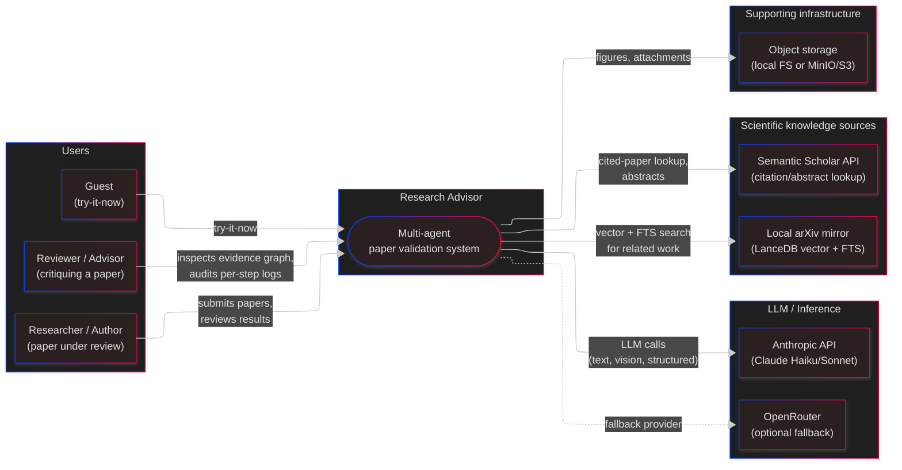

# Level 1 — System Context

The outermost view: who uses the Research Advisor, and what external systems it depends on. No internals — just the system as a black box among its neighbors.

This is the right level of granularity for a two-minute elevator pitch or a first-principles critique ("do we even need all of this?").

## What the system does

Users paste a scientific paper (text + figures + bibliography). The system runs an 8-step pipeline that:

1. Extracts logical structure and claims
2. Finds cited + related papers (arXiv mirror + Semantic Scholar)
3. Verifies figures via vision models (actual vs. expected)
4. Verifies math via an MCP calculator tool (SymPy)
5. Scores related work for relevance and whether it supports or contradicts the paper
6. Emits a confidence-scored assessment plus an auditable NetworkX graph of every claim, piece of evidence, and judgment.

## Why these neighbors

| Neighbor          | Why it's here                                                                                  |
| ----------------- | ---------------------------------------------------------------------------------------------- |
| Anthropic API     | Primary LLM for reasoning, vision, and structured output. Cheap tier (Haiku) used by default.  |
| OpenRouter        | Optional fallback / model portability — not required, controlled by `LLM_PROVIDER` env.        |
| Semantic Scholar  | Public citation graph / abstract source. Rate-limited free tier is fine for current volume.    |
| Local arXiv (LanceDB) | Keeps related-paper search fast and offline-capable. Vector + FTS hybrid.                  |
| Object storage    | Figures and attachments. Local FS in dev, MinIO/S3 in prod (storage abstraction already in place). |

## Trust boundaries

- **Browser ↔ Backend**: JWT (15-min access) + HTTP-only refresh cookie (7 days, rotated). CORS is currently fully open — flagged.
- **Backend ↔ LLM providers**: API keys in backend env only. No client-side LLM calls.
- **Backend ↔ Semantic Scholar**: Unauthenticated public API; no user data sent.
- **Backend ↔ MCP servers**: Local processes (stdio) or localhost HTTP/SSE. No network exposure.

## Questions worth asking at this level

- Is "paste a paper, get a review" the right primary interaction, or should uploads + workspace-scoped validation be first-class?
- How much of the knowledge graph (arXiv mirror) is core vs. accessory? Could we start with Semantic Scholar only?
- Who is the reviewer persona — the paper's author, or a third-party advisor? Current UI leans toward author; the auditable graph leans toward reviewer.
