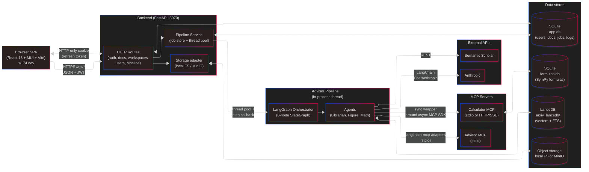

# Level 2 — Containers (Overall Architecture)

One level inside the black box: the major deployable / independently-runnable units, the protocols between them, and the data stores each one owns.

Use this diagram to ask "is this split right?" — e.g., should the pipeline be a separate service, should MCP live in-process, does the frontend need its own server at all.

## Containers at a glance

| Container           | Tech                              | Owns                               | Talks to                         |
| ------------------- | --------------------------------- | ---------------------------------- | -------------------------------- |
| Browser SPA         | React 18 + MUI v5 + Vite          | UI state (Context + local)         | Backend (HTTPS)                  |
| Backend             | FastAPI + SQLModel                | SQLite, pipeline jobs              | Pipeline (in-proc), storage, Anthropic (via pipeline) |
| Advisor Pipeline    | LangGraph + LangChain + Anthropic | State machine for validation       | MCP, Anthropic, LanceDB, Semantic Scholar |
| Advisor MCP         | MCP stdio server                  | Prompts + 5 lookup tools           | Semantic Scholar, local files    |
| Calculator MCP      | MCP stdio / HTTP-SSE              | SymPy formula DB                   | formulas.db                      |
| SQLite `app.db`     | File                              | Users, docs, workspaces, jobs/logs | —                                |
| LanceDB             | Embedded vector DB                | arXiv papers (vectors + FTS)       | —                                |
| Object storage      | FS or MinIO                       | Figures, attachments               | —                                |

## Key communication patterns

1. **Frontend → Backend — JSON over HTTP.** Axios client auto-refreshes access tokens on 401. Vite dev proxy handles CORS in dev.
2. **Backend → Pipeline — in-process thread pool.** `POST /api/pipeline/validate` creates a `PipelineJob` row, then spawns `AdvisorOrchestrator.run()` in FastAPI `BackgroundTasks`. Frontend polls `/status/:jobId` every 2s.
3. **Pipeline → MCP — language-model tool-use protocol.** Calculator MCP runs as a daemon-threaded asyncio loop wrapped by a sync facade (LangGraph is sync).
4. **Per-step callback.** After each LangGraph node, a callback writes a `PipelineStepLog` row with outputs, prompts, and duration — this is what makes the pipeline auditable.

## Where coupling lives

- **Pipeline is embedded, not a service.** Same Python process as the backend. Pros: no RPC, shared venv. Cons: can't scale pipeline workers independently of the API, a pipeline crash can take down request serving.
- **`PipelineJob.result_json` and `graph_json` are the API contract.** Frontend parses markdown out of `result_json.overall_assessment.review`. Already flagged in `CLAUDE.md` TODO as something to replace with structured JSON.
- **MCP servers are launched by the pipeline process.** Stdio transport means one-child-per-pipeline-instance. If we split the pipeline into a worker, we have to decide whether MCP lives with it or becomes its own service.

## Questions worth asking at this level

- Should the pipeline be a separate worker (Celery / RQ / custom) to isolate failures and allow horizontal scaling?
- Is the markdown-through-JSON review field going to bite us once we want to render sections independently, filter, or localize?
- Do we need LanceDB in-process, or would a dedicated vector service (pgvector, Qdrant) simplify ops?
- CORS is fully open and `/users/search` requires no auth. Both are known issues flagged in `CLAUDE.md` — probably not the right defaults for launch.
