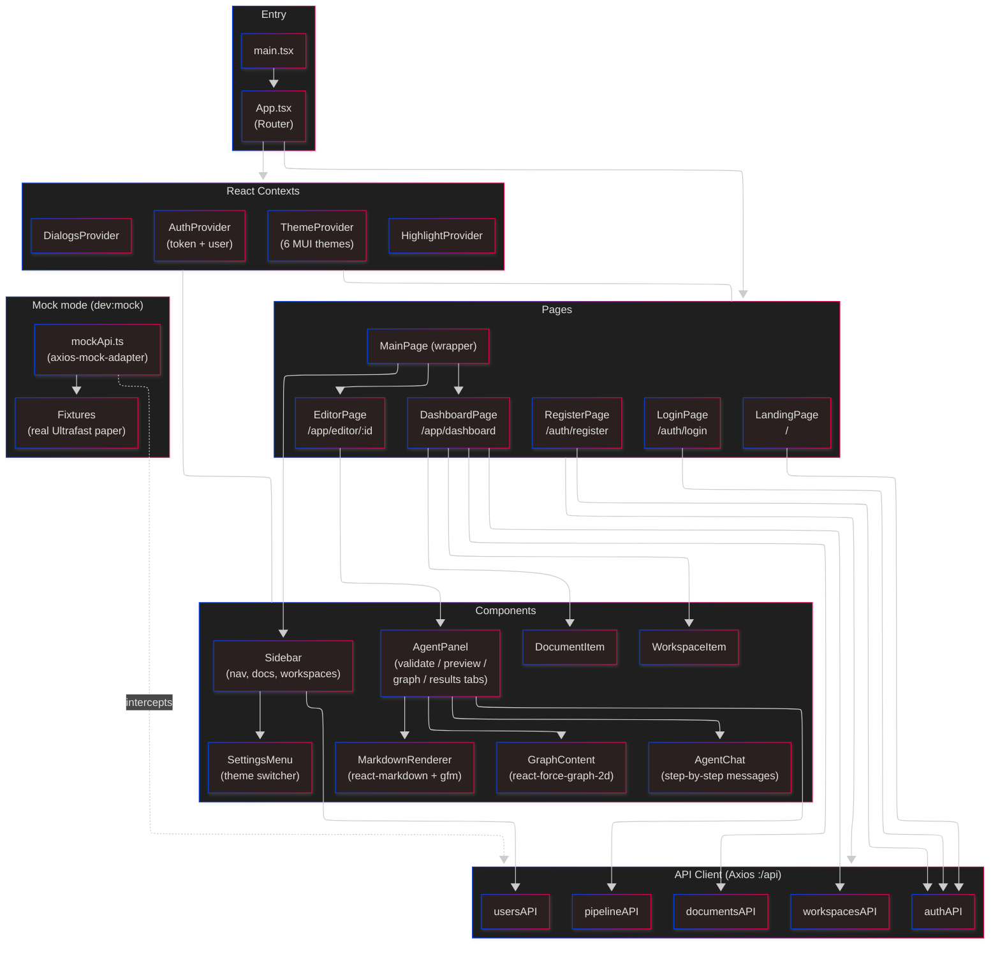

# Level 3 — Frontend Components

Inside the browser SPA. The goal: show how pages, contexts, API modules, and the validation panel compose.

## Module responsibilities

### Entry + Router

- `main.tsx` — boots React, mounts providers, reads `VITE_MOCK` env to wire mock adapter.
- `App.tsx` — `react-router-dom` v6 routes. `/app/*` routes are wrapped by `MainPage`, which renders the persistent sidebar + outlet.

### Contexts

All in `src/context/`:

| Context      | Exposes                                                 |
| ------------ | ------------------------------------------------------- |
| `AuthContext` | `user`, `login/logout/register/tryItNow`, access token in memory |
| `ThemeContext` | Current theme key + setter; persisted in localStorage  |
| `DialogsContext` | Imperative dialog open/close API                     |
| `HighlightContext` | Active text selection shared across graph + editor |

Auth token is kept in memory; refresh token is an HTTP-only cookie rotated on each refresh. Axios interceptors in `src/api/client.ts` auto-refresh on 401 — **never handle 401s at the call-site**.

### API modules (`src/api/client.ts`)

| Module         | Endpoints                                                                                |
| -------------- | ---------------------------------------------------------------------------------------- |
| `authAPI`      | `register`, `login`, `me`, `refresh`, `tryItNow`, `logout`                               |
| `documentsAPI` | `list`, `get`, `create`, `update`, `delete`, `share`, `unshare`, `listAttachments`, `uploadAttachment`, `deleteAttachment` |
| `workspacesAPI`| `list`, `get`, `create`, `update`, `delete`, `addMember`, `removeMember`, `documents`    |
| `usersAPI`     | `search`                                                                                 |
| `pipelineAPI`  | `validate`, `status`, `results`, `figures`, `history`, `jobs`, `graph`, `analysis`, `messages` |

### Validation UI — `AgentPanel`

The heart of the user-facing pipeline experience. Tabs:

- **validate** — submit button, progress bar during `status` polling, final review via `MarkdownRenderer`, graph analysis accordion.
- **preview** — paper text + attachments preview.
- **graph** — `GraphContent` renders the NetworkX graph (returned as node-link JSON).
- **results** — structured results (step validations, confidence score).

### Mock mode

- `npm run dev:mock` sets a Vite flag that wires `axios-mock-adapter` in `src/mocks/mockApi.ts` before any API call.
- Fixtures use real data from the "Ultrafast isomerization" paper so UI iteration doesn't depend on backend availability.
- Graph analysis fixture in `src/mocks/graphAnalysisFixture.ts`.

## Known frontend issues / smells

- **Dead dependencies**: `draft-js`, `react-draft-wysiwyg`, `katex`, `zustand` are installed but not imported. The editor uses a plain MUI `TextField`.
- **Markdown-through-API**: `overall_assessment.review` arrives as a markdown blob. Already tracked in `CLAUDE.md` — the backend should emit structured sections so the frontend can render, filter, or reorder them without string parsing.
- **No state library**: all state is Context + local `useState`. Works today; if the validation panel grows (e.g., highlight-in-editor-from-graph-click), a state library might pay for itself.
- **No code-splitting yet**: routes are eagerly loaded. Bundle is small enough today, but worth watching as Draft.js / KaTeX get wired up if they do.

## Questions for the architect

- Is React Context enough, or should we pick a state library now to avoid rewrites later?
- Should graph visualization switch to a WebGL lib (`sigma.js`, `react-force-graph-3d`) for larger papers?
- Is `MainPage` pulling its weight, or is it a wrapper that should be inlined?
