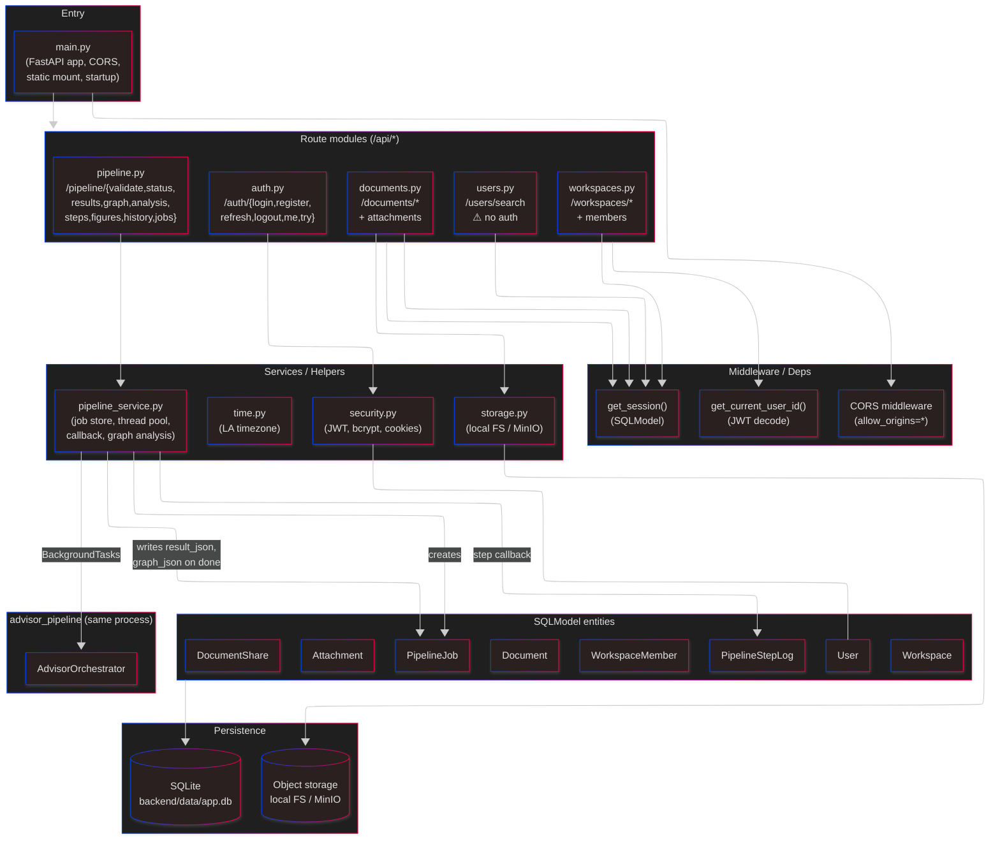
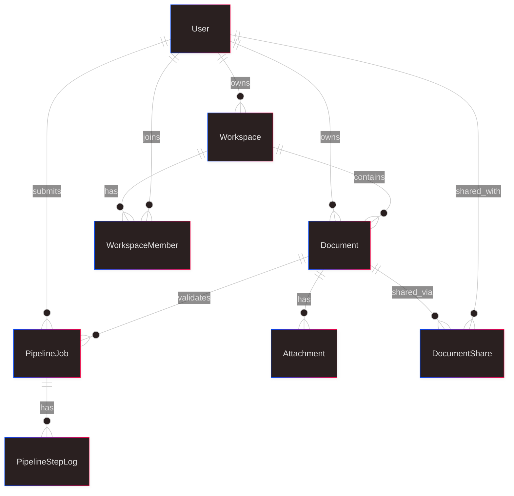

# Level 3 — Backend Components

Inside the FastAPI app. Shows routes, services, persistence, and the async job model.

## Request lifecycle (typical authenticated call)

1. Axios call to `/api/documents` with `Authorization: Bearer <access>`.
2. CORS middleware passes (open in dev).
3. `get_session()` yields a SQLModel session, rolled back on exception.
4. `get_current_user_id()` decodes the JWT — rejects with 401 if invalid/expired.
5. Route handler queries via session, returns a Pydantic response.
6. Frontend interceptor: on 401, calls `/api/auth/refresh` (cookie-based) and retries the original request once.

## Pipeline job lifecycle

See [07-pipeline-sequence.md](07-pipeline-sequence.md) for the full sequence. Short version:

1. `POST /api/pipeline/validate` — `create_job()` inserts a `PipelineJob` (`status=pending`), returns `job_id`.
2. `BackgroundTasks` schedules `run_pipeline_async()` in a thread.
3. The thread constructs `AdvisorOrchestrator(on_step_complete=callback)` and runs `.invoke()`.
4. The callback writes a `PipelineStepLog` row per node (step number, name, output dict, duration).
5. On completion, the service:
   - Serializes `ValidationResult` → `PipelineJob.result_json`
   - Serializes the NetworkX graph (node-link) → `PipelineJob.graph_json`
   - Sets `status=completed`
6. Frontend polls `GET /api/pipeline/status/:jobId` until `completed` or `failed`.

## Data model — key relationships

See [06-data-model.md](06-data-model.md) for the full entity attributes.

## Pipeline service responsibilities

`backend/app/services/pipeline_service.py` does a lot:

- **Job CRUD**: `create_job`, `get_job`, `list_jobs`.
- **Execution**: `run_pipeline_async` — creates the orchestrator, passes a callback closure that writes to `PipelineStepLog`.
- **Input hydration**: reads figures from `Attachment` rows, resolves storage paths (local / presigned-URL for MinIO), base64-encodes them for the pipeline.
- **Graph analysis**: `get_graph_analysis` — rebuilds the NetworkX graph from `graph_json` and runs query helpers (contradicted steps, invalid math, librarian stats, figure-confirmation counts).
- **Step introspection**: `get_step_log`, `get_step_logs` for the UI's per-step audit view.

## Known issues

- **CORS fully open** (`allow_origins=["*"]`). OK in dev, wrong for launch.
- **`/users/search` requires no auth**. Anyone can enumerate usernames.
- **`instructor` in requirements but unused** — structured output uses LangChain's `.with_structured_output()`.
- **Pipeline runs in-process**. A crash in an agent can take down the API.
- **SQLite for everything, including jobs.** Fine for single-host; a launch with concurrent users / multiple API replicas needs Postgres + a real queue.

## Questions for the architect

- Move to Postgres + Alembic migrations before launch? SQLModel supports both.
- Extract the pipeline into a worker (Celery / RQ / Arq) to decouple failure domains and enable horizontal scaling?
- Replace `BackgroundTasks` with a durable queue so jobs survive restarts?
- Should job outputs stream via WebSocket / SSE instead of polling?
