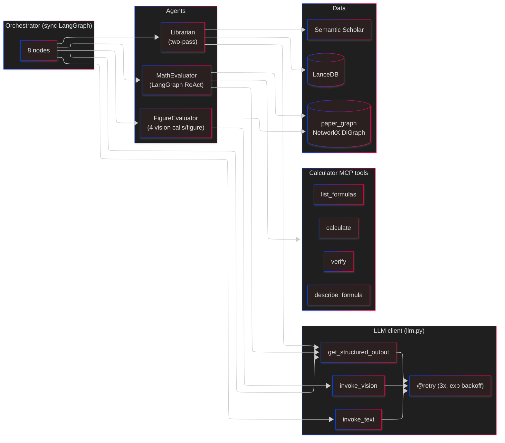
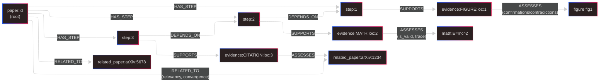

# Level 3 — Advisor Pipeline

The 8-node LangGraph state machine. Each node reads from and writes to `AdvisorState` (a TypedDict). Between nodes, a callback persists progress to SQLite for the UI to poll.

## Top-level graph

```mermaid
---
config:
  theme: neo-dark
  look: neo
  layout: elk
---
flowchart LR
    START(["START"]) --> MC["1. make_context<br/>(LLM text)"]
    MC --> GP["2. gather_papers<br/>(Librarian pass 1)"]
    GP --> ML["3. map_logic<br/>(PaperStructure)"]
    ML --> FE["4. find_evidence<br/>(StepEvidence[])"]
    FE --> EF["5. evaluate_figures<br/>(FigureEvaluator)"]
    EF --> EM["6. evaluate_math<br/>(MathEvaluator ReAct)"]
    EM --> SP["7. score_papers<br/>(Librarian pass 2)"]
    SP --> CR["8. compile_results<br/>(ValidationResult)"]
    CR --> END(["END"])

    MC -. "callback" .-> Log[("PipelineStepLog")]
    GP -. .-> Log
    ML -. .-> Log
    FE -. .-> Log
    EF -. .-> Log
    EM -. .-> Log
    SP -. .-> Log
    CR -. .-> Log
```

## What each node does, and what it writes to state

| # | Node              | Reads                                  | Writes to `AdvisorState`                              | External calls                              |
| - | ----------------- | -------------------------------------- | ----------------------------------------------------- | ------------------------------------------- |
| 1 | `make_context`    | `paper_text`                           | `paper_context`                                       | Anthropic `invoke_text`                     |
| 2 | `gather_papers`   | `paper_context`, `bibliography`        | `librarian_result`, `related_papers`                  | LanceDB (FTS + vector), Semantic Scholar    |
| 3 | `map_logic`       | `paper_text`, `paper_context`          | `paper_structure` (steps + claims)                    | Anthropic structured output → `PaperStructure` |
| 4 | `find_evidence`   | `paper_structure`, `paper_text`        | `step_evidence`, `paper_graph` (initial build)        | Anthropic structured output → `StepEvidence` |
| 5 | `evaluate_figures`| `paper_graph`, `figures`               | `figure_evaluations`, updates `paper_graph`           | Anthropic vision × 4 per figure             |
| 6 | `evaluate_math`   | `paper_graph`, extracted equations     | `math_evaluations`, updates `paper_graph`             | Calculator MCP (stdio/SSE) + Anthropic      |
| 7 | `score_papers`    | `related_papers`, `paper_structure`    | scored `librarian_result`, updates `paper_graph`      | Anthropic structured output per paper       |
| 8 | `compile_results` | entire state                           | `validation_result` (`ValidationResult`)              | Anthropic structured output → `OverAllReview` |

Source: [advisor_pipeline/orchestrator.py](../../advisor_pipeline/orchestrator.py).

## Agents (composed inside nodes)



### FigureEvaluator ([figure_evaluator.py](../../advisor_pipeline/agents/figure_evaluator.py))

Four vision calls per figure:

1. **Describe actual** — what the submitted figure shows.
2. **Describe expected** — what the figure *should* show given the paper's claim.
3. **Compare** — differences between actual and expected.
4. **Assess claims** — for each claim tied to this figure, confirm or contradict.

### MathEvaluator ([math_evaluator.py](../../advisor_pipeline/agents/math_evaluator.py))

LangGraph ReAct agent over Calculator MCP tools. For each equation in a step (extracted with ±500 chars of context), the agent decides whether to verify, calculate, or look up a formula — then writes a `MathEvaluation` with `is_valid`, notes, and trace.

### Librarian ([librarian.py](../../advisor_pipeline/agents/librarian.py))

Two passes, split across pipeline nodes 2 and 7:

- **Pass 1 (`gather_papers`)** — FTS lookup for cited titles, vector search for related work, Semantic Scholar fallback for cited papers not in LanceDB. Produces `RelatedPaper[]`.
- **Pass 2 (`score_papers`)** — for each paper, LLM assigns `relevancy ∈ [0,1]` and `convergence ∈ [-1,+1]` (negative = contradicts the paper, positive = supports).

## The paper graph — the auditable output

Built by `find_evidence`, enriched by the evaluation nodes. NetworkX `DiGraph` with typed nodes and edges. See [models/paper_graph.py](../../advisor_pipeline/models/paper_graph.py).



Query helpers expose: `get_contradicted_steps`, `get_invalid_math`, `get_librarian_statistics`, `get_figure_confirmation_counts`, `get_steps_with_no_evidence`, `get_high_impact_papers`, etc.

## LLM client ([llm.py](../../advisor_pipeline/llm.py))

Single shared `ChatAnthropic`. Default model: `claude-haiku-4-5-20251001`. All three helpers are decorated with `@retry(3, exponential_backoff)`:

- `invoke_text(prompt) -> str`
- `invoke_vision(text, media_type, base64_data) -> str`
- `get_structured_output(schema, prompt) -> schema_instance` — wraps `.with_structured_output(PydanticModel)`.

OpenRouter is a drop-in alternative via `LLM_PROVIDER=openrouter` — no code changes needed.

## Prompt templates

All prompts live with the advisor MCP server ([mcp_servers/advisor_server/prompts.py](../../advisor_pipeline/mcp_servers/advisor_server/prompts.py)): `SYSTEM_PROMPT`, `CONTEXT_MAKER`, `LOGIC_MAPPER`, `EVIDENCE_FINDER`, `FIGURE_DESCRIBER`, `FIGURE_EXPECTED`, `FIGURE_COMPARATOR`, `CLAIM_ASSESSOR`, `MATH_VERIFIER`, `MATH_REPORTER`, `LIBRARIAN_*`, `RESULTS_COMPILER`. Keeping them next to the MCP tools means they're loadable by an external MCP client too.

## Questions for the architect

- Is the strict linear 8-node graph the right shape, or should some steps fan out (one node per figure, one per step) for parallelism? LangGraph supports conditional edges + parallel branches — we're not using either yet.
- Per-figure vision does 4 LLM calls; for a 10-figure paper that's 40 calls serialized. Batching / parallel dispatch would help latency a lot.
- The Librarian's two passes share state via the graph but are split by a lot of nodes — is that the right cut, or should all librarian work be co-located?
- Math extraction with ±500 char context is heuristic — do we want a proper math parser (e.g., `unified-latex`)?
