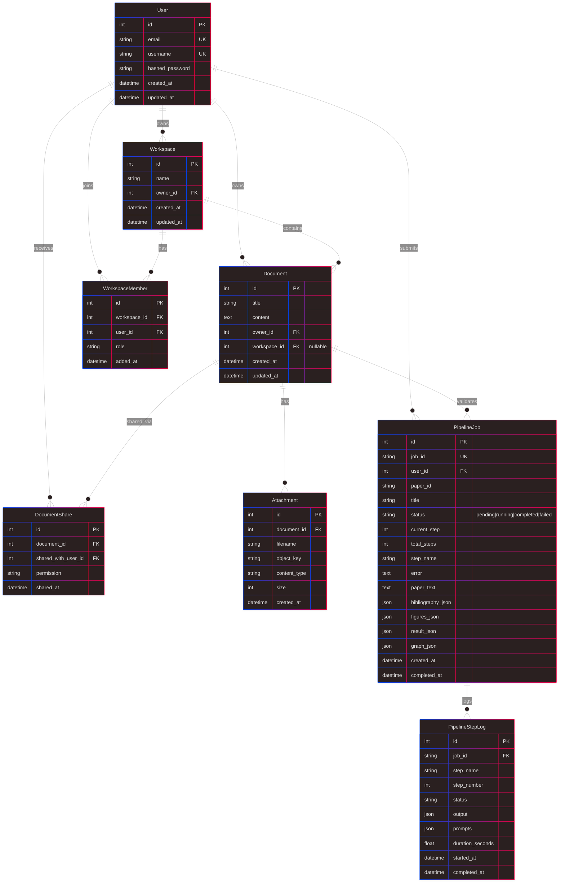
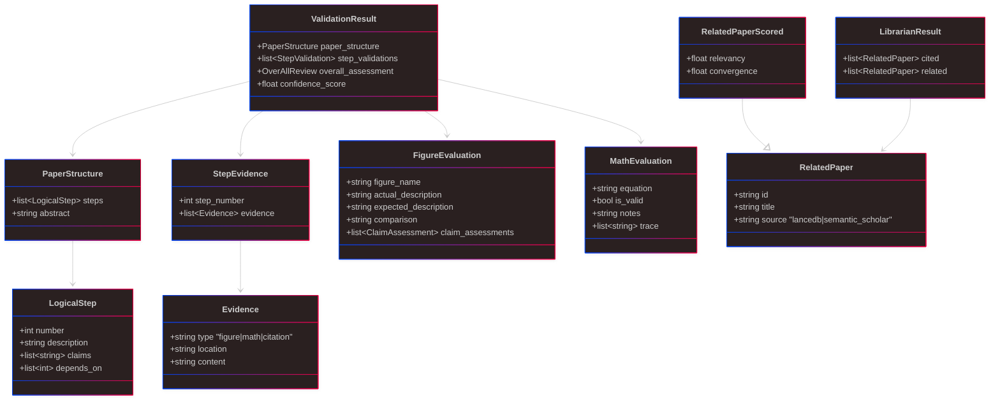

# Data Model

Entity-relationship view of everything persisted to SQLite, plus the "shape" data stored in LanceDB and object storage.

## SQLite entities (`backend/data/app.db`)

## Key design choices

- **`PipelineJob` stores inputs *and* outputs.** `paper_text`, `bibliography_json`, `figures_json` are the inputs snapshot; `result_json` and `graph_json` are the outputs. This means a job is fully reconstructable from its row — nice for reruns and debugging.
- **`PipelineStepLog` per node.** `output` is the state delta returned by the node; `prompts` captures what was sent to the LLM. This is the audit trail.
- **`graph_json`** is NetworkX node-link format. The backend rebuilds the `DiGraph` on demand for analysis queries.
- **`figures_json`** is `{figure_name: {base64, media_type, predicted?}}` — figures are inlined as base64, not object-storage refs, inside the job row. Object storage is used for the *original* attachments on `Document`; the pipeline gets a materialized copy.

## Pipeline-side models (Pydantic — not persisted directly, serialized into `result_json`)

Source: [advisor_pipeline/models/schemas.py](../../advisor_pipeline/models/schemas.py).

## Other data stores

| Store                | Shape                                                                 | Purpose                                          |
| -------------------- | --------------------------------------------------------------------- | ------------------------------------------------ |
| LanceDB `arxiv_lancedb/` | arXiv papers with vector embeddings (`BAAI/bge-small-en-v1.5`) + FTS | Related-paper search for the Librarian          |
| Formula DB (SQLite)  | `Formula(id, name, latex, variables, category)`                       | Calculator MCP — SymPy-solvable formulas         |
| Object storage       | `object_key → bytes`                                                  | Figures + attachments (local FS or MinIO)        |

## Known issues

- **`figures_json` as base64 inside the job row** balloons SQLite rows. For larger papers / batching, store refs to object storage instead.
- **No migrations.** `SQLModel.metadata.create_all()` at startup creates missing tables but doesn't evolve existing ones. Will need Alembic before launch if the schema changes after users have data.
- **No soft delete / audit columns** on most tables — deletes are hard. Fine for now; add `deleted_at` when we have shared documents people can't afford to lose.

## Questions for the architect

- SQLite → Postgres timing. When does the single-writer bottleneck start to hurt?
- Should `PipelineStepLog.output` be capped / truncated? It holds whole state deltas and can be large.
- Do we want event sourcing for jobs (append-only log of state transitions) or is the current "update the row" model enough?
