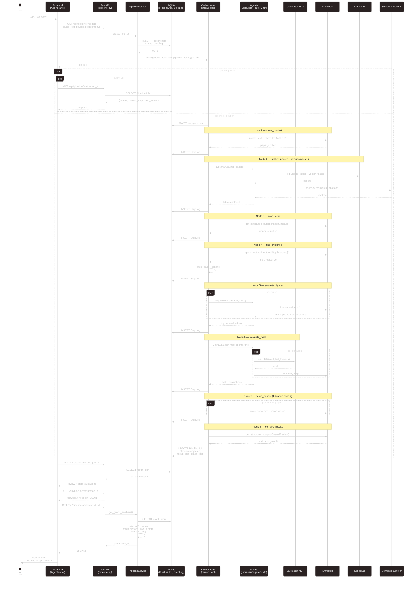

# Pipeline Sequence — Submit → Poll → Render

End-to-end interaction for the primary user flow: a user submits a paper and watches the validation pipeline run.

## Notes on the flow

- **Polling, not streaming.** The frontend hits `/status/:jobId` every 2s. Candidate for SSE or WebSocket upgrade — the pipeline already has a step callback that could emit events.
- **Pipeline is serial.** Every node waits on the previous. Figures and math could parallelize trivially; related-paper scoring could batch.
- **Durability gap.** `BackgroundTasks` runs in the same process. If uvicorn restarts mid-pipeline, the job is stuck in `running`. A real queue (Arq / RQ / Celery) with a retry/claim model would fix this.
- **Three separate fetches at the end** (`results`, `graph`, `analysis`). Each hits the DB and deserializes `graph_json`. A single `/complete/:jobId` endpoint or GraphQL-style selector could cut a round-trip and decode cost.

## Failure modes — what happens when...

| Failure                              | Current behavior                                                 | What probably should happen                      |
| ------------------------------------ | ---------------------------------------------------------------- | ------------------------------------------------ |
| Anthropic call fails                 | `@retry` 3× exp backoff; exception → job `failed` with stack     | Good; consider a circuit breaker for outages     |
| MCP calculator unreachable           | Tool call raises; `@retry` doesn't cover it → step fails         | Graceful fallback: mark math `is_valid=None`      |
| Process restart mid-run              | Job stuck at `running` forever                                   | Durable queue + claim/ack or startup sweeper     |
| LanceDB missing / empty              | Librarian returns no related papers silently                     | Assert at startup; warn in status                |
| Figures exceed vision context        | Vision call truncates or errors                                  | Pre-flight size check, downscale before upload   |
| User navigates away during polling   | No harm — backend keeps running; user can come back              | Fine as long as we don't silently drop websocket |

## Questions for the architect

- Is 2-second polling the right cadence, or should we push SSE updates?
- Should failed jobs be auto-retriable from the UI, or always manual?
- Should we cap pipeline runtime (e.g., 10 minutes) and kill with a clear error, or leave it unbounded?
