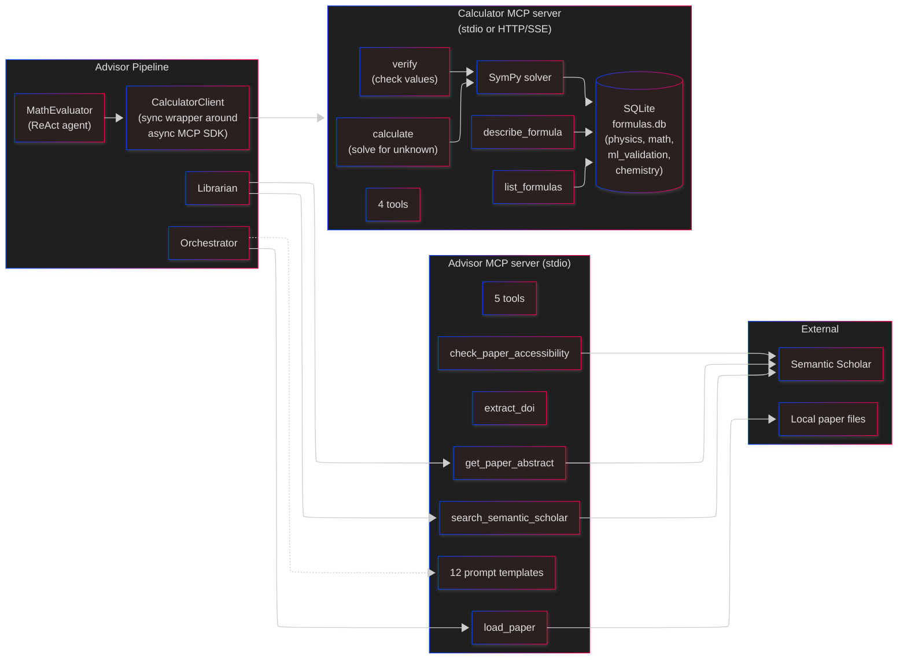
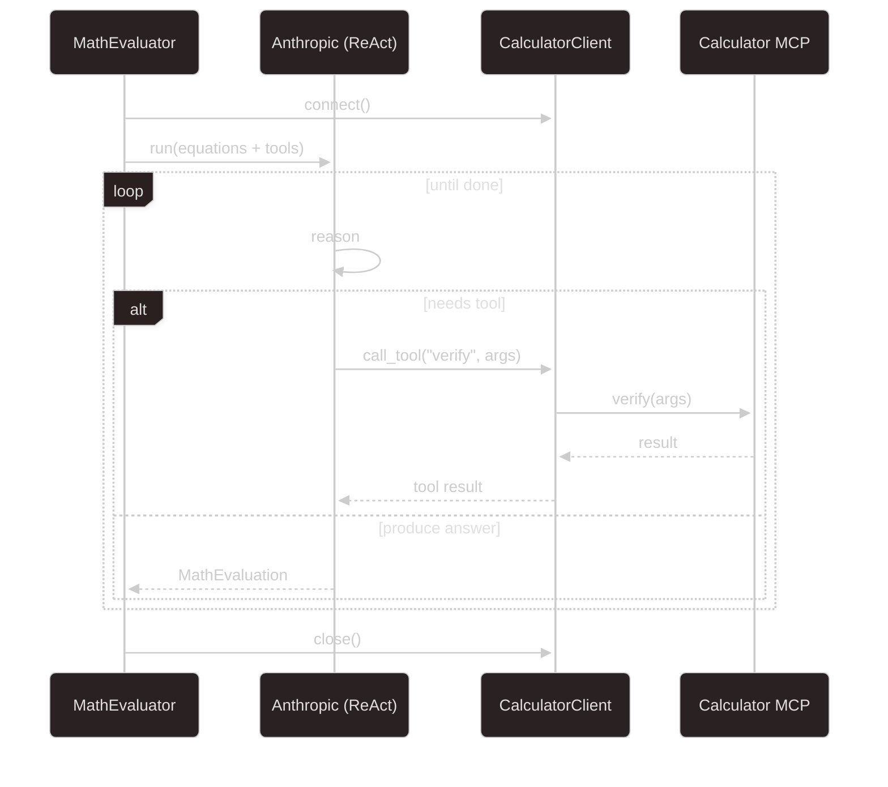

# MCP Integration

Model Context Protocol servers used by the pipeline. Two servers: one for advisor-specific lookups, one for math.

## Advisor MCP server ([mcp_servers/advisor_server/](../../advisor_pipeline/mcp_servers/advisor_server/))

- **Transport**: stdio.
- **Launched by**: the pipeline process (or by an external MCP-aware client like Claude Desktop).
- **Exposes**:
  - **12 prompt templates** (see [prompts.py](../../advisor_pipeline/mcp_servers/advisor_server/prompts.py)). Keeping prompts on the MCP server means any MCP-aware host can load them — including future non-pipeline clients.
  - **5 tools** (see [tools.py](../../advisor_pipeline/mcp_servers/advisor_server/tools.py)): `load_paper`, `search_semantic_scholar`, `get_paper_abstract`, `check_paper_accessibility`, `extract_doi`.

## Calculator MCP server ([mcp_servers/calculator_server/](../../advisor_pipeline/mcp_servers/calculator_server/))

- **Transports**: stdio *or* HTTP/SSE (chosen via `CALCULATOR_TRANSPORT`).
- **Tools** (in [mcp_tools.py](../../advisor_pipeline/mcp_servers/calculator_server/tools/mcp_tools.py)):
  - `calculate` — given n-1 variables, solve for the remaining one using SymPy.
  - `verify` — check whether given values satisfy the formula.
  - `list_formulas` — discover available formulas, optionally filter by category.
  - `describe_formula` — variables, units, category.
- **Data**: SQLite `Formula` table with categories `physics`, `math`, `ml_validation`, `chemistry`.

## Why a sync wrapper? ([mcp_client.py](../../advisor_pipeline/mcp_client.py))

The MCP Python SDK is async. LangGraph executes synchronously. To bridge without rewriting LangGraph-the-framework as async everywhere, `CalculatorClient` runs an asyncio event loop in a daemon thread and exposes blocking methods (`connect()`, `call_tool()`, `close()`).

## How tools land in the ReAct agent

## Known issues / smells

- **Server lifecycle is pipeline-scoped.** If the pipeline crashes mid-run, orphan MCP processes could pile up. A supervisor or `atexit` hook per client helps.
- **stdio is one-child-per-instance.** Horizontal pipeline workers means N MCP child processes. If this gets expensive, switch Calculator to SSE and run one server.
- **No auth / no sandboxing** on the MCP servers — they're local and trusted. If we ever expose them across a network, that assumption breaks.

## Questions for the architect

- Should we standardize on one transport (SSE) so there's less branching in client code?
- Is it worth promoting the Advisor MCP to a first-class, reusable server (so other hosts can run the same validation flow)?
- Should the pipeline's LLM call itself be an MCP tool (model-agnostic orchestration), or is that too much indirection?
