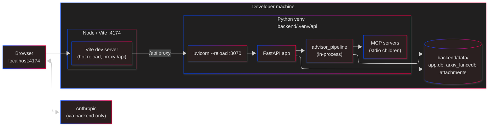
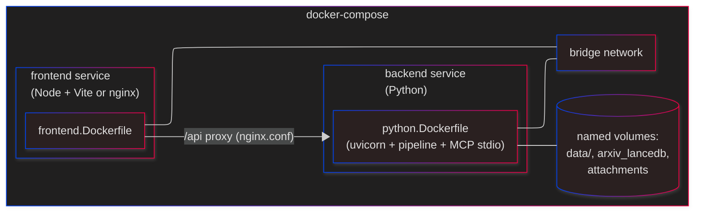
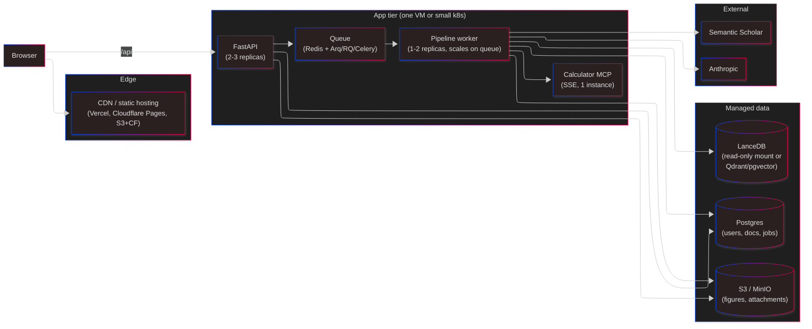

# Deployment View

How the pieces are actually run — dev, Docker, and where they could live in a first-launch prod setup.

## Dev (local, no containers)

Start: `./scripts/start-dev.bat` (Windows) or `./scripts/start-dev.sh`.

## Docker (CPU + GPU profiles)

Key Dockerfiles: [docker/python.Dockerfile](../../docker/python.Dockerfile), [docker/frontend.Dockerfile](../../docker/frontend.Dockerfile). Composes: [docker-compose.yml](../../docker/docker-compose.yml) (base), [docker-compose.dev.yml](../../docker/docker-compose.dev.yml) (hot-reload), [docker-compose.gpu.yml](../../docker/docker-compose.gpu.yml) (CUDA for embeddings / optional local LLM).

Make targets:
- `make dev` — dev CPU
- `make dev-gpu` — dev GPU
- `make up-cpu` / `make up` — prod CPU / GPU
- `make logs-api`, `make logs-frontend`, `make status`, `make health`

## A plausible first-launch topology (pre-alpha → alpha)

This is a suggestion, not a commitment. See [10-future.md](10-future.md) for a fuller conceptual future.

### Notable differences from today

- **Frontend is static.** Built once, served from a CDN. Vite dev proxy becomes irrelevant; the API URL is configured at build time or runtime.
- **SQLite → Postgres.** Jobs, users, docs. Alembic migrations.
- **Pipeline → queue-driven worker.** Decouples API availability from pipeline execution. Job state survives restarts.
- **LanceDB mounted read-only** (rebuilt out of band), or replaced with a managed vector DB (Qdrant, pgvector) if we want hosted.
- **Calculator MCP as a long-running SSE service**, not stdio per-pipeline.

## Known issues to fix before launch

- CORS fully open.
- `/users/search` unauthenticated.
- No rate limiting on API, especially `/pipeline/validate`.
- No observability: structured logs, metrics, tracing. Today the `print` statements in the orchestrator are the main visibility.
- Secrets live in `.env` — a proper secret store (Vault / AWS SM / 1Password Connect) before we have real users.

## Questions for the architect

- One VM or k8s for alpha? Cost vs. operational overhead — we don't need HA yet.
- Which queue? Arq (asyncio-native) is the lightest; Celery is heaviest but most battle-tested.
- Do we want to keep LanceDB or switch to Qdrant/pgvector for ops ergonomics?
- Where does MinIO live in a managed world — do we just go to S3 and drop the abstraction?
