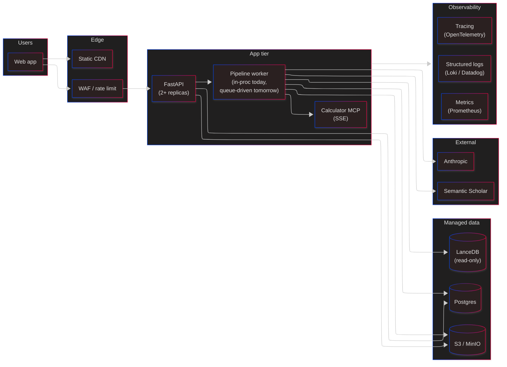
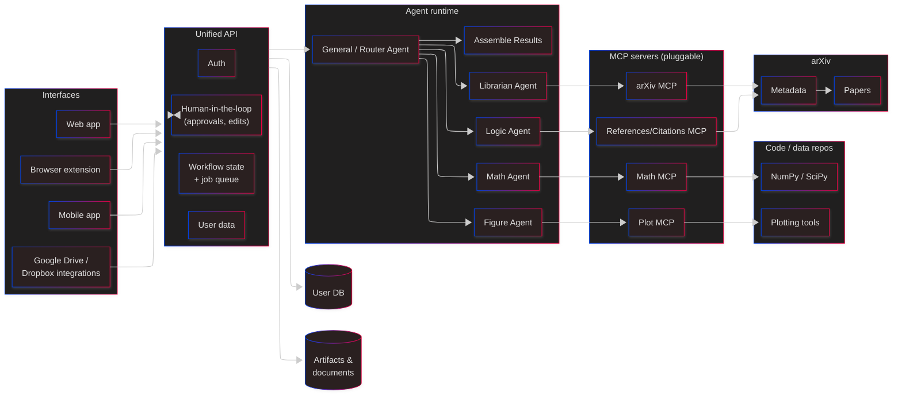
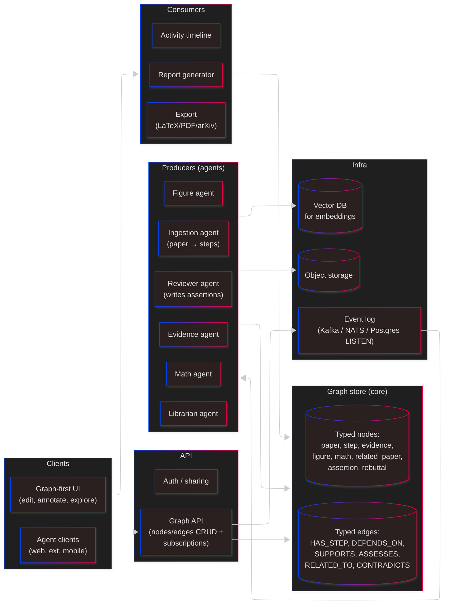

# Conceptual Future Architectures

This project is pre-alpha. The goal of this doc is not to commit to anything — it's to sketch a few plausible shapes we might grow into, so the architect has concrete options to push back on or combine.

Three sketches, from most-conservative to most-ambitious.

---

## A) Minimal-lift launch ("what we have, production-ready")

Keep the current architecture almost verbatim. Fix the known issues, harden security, add observability. No rewrites.

**Changes from today:**

- CORS locked to known origins.
- `/users/search` behind auth.
- Postgres instead of SQLite.
- Pipeline extracted into a worker behind a small queue (Arq / RQ).
- MCP Calculator as an SSE service (not stdio per pipeline).
- Rate limiting on `/pipeline/validate` (cost control).
- Structured logging + basic metrics + OpenTelemetry traces.
- Secrets via managed secret store.

**Trade-offs:** Ships fast. Preserves the LangGraph + agent shape. Doesn't solve latency (serial pipeline) or extensibility (hard to add new agents / new interfaces).

---

## B) Multi-interface, agent-first ("the shape implied by the user's original sketch")

Reshape around the original diagram the user drew: multiple interfaces (web, extension, mobile, Drive), a unified API, a general-purpose router agent that dispatches to specialists, and pluggable MCP servers.

**Why:** Matches the product story the user already has. Decouples interfaces (a browser extension that validates a paper on arXiv is a natural fit). Agents become swappable, not baked into LangGraph nodes.

**Changes from today:**

- LangGraph orchestrator becomes a **router agent** that decides which specialists to call, possibly in parallel. Logic/Math/Figure/Librarian become tool-using agents behind the same MCP abstraction.
- Explicit human-in-the-loop primitives on the API — the current "job runs to completion" model becomes "job pauses on a question, resumes on user input."
- Interfaces multiply. The API surface stays stable.
- Pluggable MCP registry — new validators (plots, stats, chemistry) show up as new servers without touching the router.

**Trade-offs:** Bigger lift. More moving parts. Router-agent reliability is a real concern (we'd need strong guardrails). Latency could *improve* if specialists run in parallel.

---

## C) Graph-native, evidence-first ("the knowledge graph is the product")

Take seriously that the paper graph *is* the real output. Build the whole system around incremental graph construction, with agents as producers/consumers of typed graph nodes, and the UI as a graph editor.

**Why:** The paper graph already exists as a side product. Making it the primary artifact means:

- Agents become independent producers that react to graph changes (evidence added → figure agent wakes up).
- Users can edit the graph directly — annotate a step, add a counter-example, attach a new citation — and the downstream graph updates.
- Reruns are cheap: invalidate one node, replay only what depends on it.
- Reviewer / advisor / co-author workflows become natural: multiple humans + multiple agents editing the same graph.

**Changes from today:**

- The rigid 8-step linear pipeline goes away. Replaced by event-driven agents subscribing to graph changes.
- Storage becomes a graph (Postgres with adjacency tables is fine; Neo4j is overkill at this stage).
- The UI becomes graph-first — the current markdown review is generated from the graph, not stored alongside it.
- Job state becomes "the graph plus an activity log" — no more `PipelineJob.status`.

**Trade-offs:** Biggest rewrite. Highest conceptual clarity if it works. Graph editors are hard to build well. Consistency/race-condition risk across agents writing to the same graph.

---

## How to decide

| Question                                                      | Pushes toward |
| ------------------------------------------------------------- | ------------- |
| "Is validation a one-shot or a workflow?"                     | One-shot → A; workflow → B or C |
| "Do users want to edit the evidence graph?"                   | Yes → C       |
| "Do we want a browser extension or Drive integration in v1?"  | Yes → B       |
| "How much engineering budget do we have for launch?"          | Low → A; medium → B; high → C |
| "Is the graph a byproduct or the product?"                    | Product → C   |
| "How important is parallelism / latency?"                     | Critical → B or C |

## Things that don't change across all three

- **The LLM boundary** — Anthropic-via-LangChain + MCP tools is a good bet regardless of shape.
- **The evidence taxonomy** — typed nodes/edges (step, evidence, figure, math, related_paper) are worth keeping.
- **Per-step auditability** — wherever reasoning happens, we should be able to show the user what was sent, what came back, and why the conclusion was reached.
- **Pluggable knowledge sources** — LanceDB today, maybe Qdrant tomorrow; Semantic Scholar today, maybe OpenAlex or S2-plus tomorrow. The Librarian abstraction shouldn't care.

## Open questions for the architect

- Is the product "a validation report" or "a living evidence graph"? That single answer changes everything.
- Is "one paper at a time" enough, or do we need workspace/project-level cross-paper validation (e.g., "does this paper contradict anything else in our workspace")?
- Who owns the graph — the author, the advisor, or the reviewer? Access control implications cascade through all three shapes.
- How much of the pipeline do we want to be steerable by the user (e.g., "focus on math, skip figures this run")?
