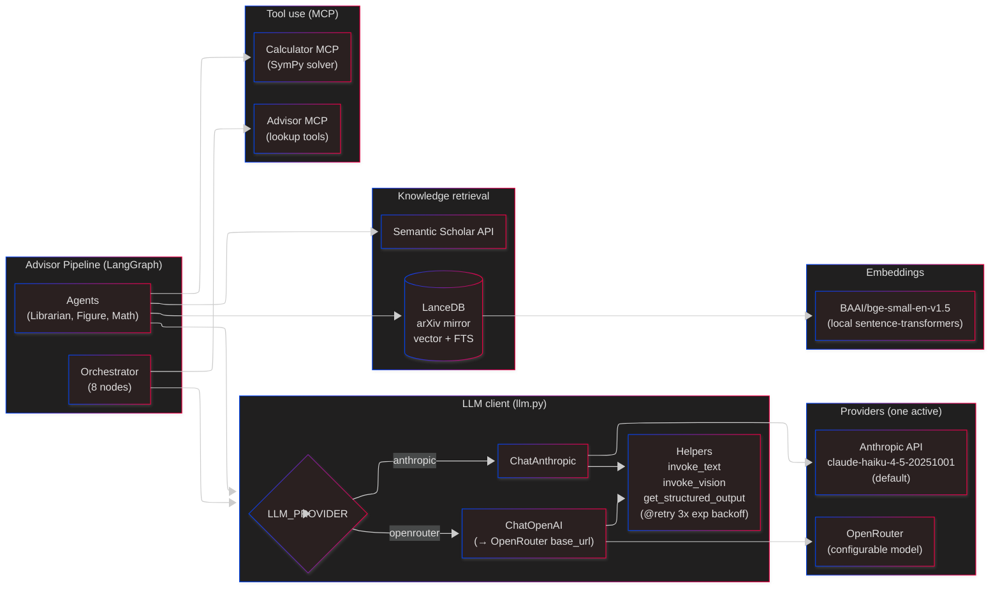
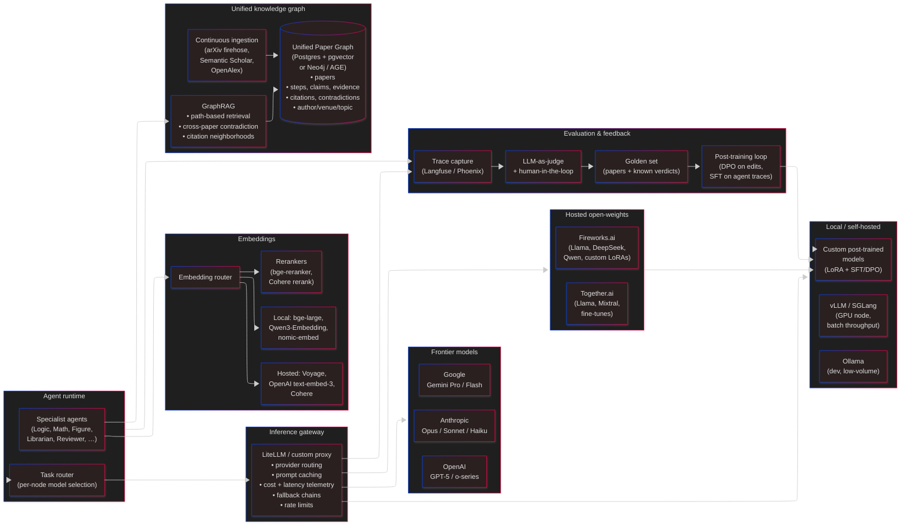

# AI Tech Stack — Current & Future

This doc isolates the AI-specific parts of the architecture from the rest of the system: what models we call, how we call them, how we search, how we represent knowledge. The product architecture ([02-containers.md](02-containers.md), [05-pipeline.md](05-pipeline.md)) can stay the same while this layer evolves; conversely, the AI stack can evolve without most of the product-level code changing.

Two sections: **Current** (what's actually running today) and **Future** (where we want to go).

---

## Current AI stack

### What's running

| Layer               | Tech today                                                                 | Where it lives                                              |
| ------------------- | -------------------------------------------------------------------------- | ----------------------------------------------------------- |
| Primary LLM         | **Anthropic** — `claude-haiku-4-5-20251001` (default)                      | [advisor_pipeline/llm.py](../../advisor_pipeline/llm.py)    |
| Fallback LLM        | **OpenRouter** (any model ID) — toggled via `LLM_PROVIDER` env             | same                                                        |
| LLM framework       | LangChain (`ChatAnthropic`, `ChatOpenAI`)                                  | same                                                        |
| Orchestration       | LangGraph `StateGraph`                                                     | [advisor_pipeline/orchestrator.py](../../advisor_pipeline/orchestrator.py) |
| Tool-use protocol   | MCP (stdio + HTTP/SSE transports)                                          | [advisor_pipeline/mcp_servers/](../../advisor_pipeline/mcp_servers/) |
| Structured output   | `ChatAnthropic.with_structured_output(PydanticModel)`                      | every `get_structured_output()` call                        |
| Vision              | `ChatAnthropic.invoke` with image content blocks                           | [figure_evaluator.py](../../advisor_pipeline/agents/figure_evaluator.py) |
| Embeddings          | `BAAI/bge-small-en-v1.5` — small, fast, local                              | LanceDB ingestion (external script)                         |
| Vector + FTS search | **LanceDB** hybrid (vector similarity + full-text)                         | [advisor_pipeline/agents/librarian.py](../../advisor_pipeline/agents/librarian.py) |
| External search     | **Semantic Scholar API** (unauthenticated, free tier)                       | same + [advisor_server/tools.py](../../advisor_pipeline/mcp_servers/advisor_server/tools.py) |
| Reliability         | `tenacity.@retry(3, wait_exponential)` on every LLM call                   | [llm.py](../../advisor_pipeline/llm.py)                     |

### Characteristics of today's stack

- **Single provider at a time.** `LLM_PROVIDER=anthropic` or `openrouter` — no per-task routing, no mixture. Every node uses the same model.
- **Haiku-only by default.** Cheap, fast, good enough for structured output + vision. We haven't sent any task to Sonnet or Opus.
- **No local inference.** Embeddings are the only thing running locally.
- **No caching.** Prompt caching, result caching, and embedding caching are all absent. Every pipeline run re-does every LLM call from scratch.
- **No evals.** No ground-truth set, no regression tests for the pipeline's output quality.
- **Single, isolated paper graph per run.** Each submission produces its own NetworkX graph in SQLite. No cross-paper graph.
- **Tool use via MCP** is already in place — that's a deliberate choice to keep tools portable.

### What this is good at

- Shipping a working prototype cheaply. Haiku + structured output + MCP tools is a very productive stack for a pre-alpha.
- Provider portability. The `LLM_PROVIDER` switch means we're not locked into Anthropic at the code level.
- Auditability. Every LLM call flows through `llm.py`; every pipeline step is logged. The seams to add caching, routing, or evals are all present.

### What this is bad at

- **Cost scaling.** Every run does all the work. A 10-figure paper is ~40 vision calls + ~30 text calls per submission. Rerunning on a tweaked paper repeats all of it.
- **Quality ceiling.** Haiku is cheap but occasionally confidently wrong on math extraction and figure claim assessment. There's no path today to "use Sonnet for this node, Haiku for that node."
- **Knowledge isolation.** The Librarian's LanceDB + Semantic Scholar results get dropped into *this run's* graph and that's it. Two papers that contradict each other via their cited work never meet.
- **No specialization.** The same general-purpose LLM does logic extraction, math extraction, figure interpretation, and review writing. Each of those is a different task with a different failure mode.

---

## Future AI stack

Goal: a **mixture of local, hosted-open, and frontier models**, each routed to tasks they're best at, plus a **unified knowledge graph** that accumulates across every paper the system has ever seen.

### Major changes from today

#### 1. Inference gateway (not provider SDKs directly)

Put all LLM calls behind one proxy. Candidates: **LiteLLM**, **OpenRouter itself as the gateway**, or a thin in-house FastAPI shim. The gateway owns:

- **Provider routing** — per-task, per-tenant, or per-cost-budget.
- **Prompt caching** — Anthropic's native prompt caching for frontier; KV-cache reuse for local (vLLM).
- **Fallback chains** — try Fireworks Llama-3.1-70B → Together Llama-3.1-70B → Anthropic Sonnet on failure.
- **Rate limiting / cost caps** per user.
- **Observability** — token counts, latency, cost per call, attached to a trace ID.

This is one box on the diagram; internally it's probably LiteLLM-in-a-container.

#### 2. Mixture of models, routed per task

Not one model for the whole pipeline. A plausible routing table:

| Task                                      | Model today       | Model future (plausible)                          |
| ----------------------------------------- | ----------------- | ------------------------------------------------- |
| Context summarization (`make_context`)    | Haiku             | Local Llama-3.1-8B on vLLM — it's a cheap summary |
| Logic extraction (`map_logic`)            | Haiku             | Sonnet / GPT-5 — correctness matters; low volume  |
| Evidence extraction (`find_evidence`)     | Haiku             | Sonnet or a custom post-trained 8B-14B model      |
| Figure vision (`evaluate_figures`)        | Haiku vision      | Claude vision (Sonnet) for assessment + Llama-Vision for description |
| Math ReAct (`evaluate_math`)              | Haiku             | Opus or o-series — reasoning-heavy                |
| Librarian scoring                         | Haiku             | Hosted open-weights 70B via Fireworks — batched   |
| Final compilation                         | Haiku             | Sonnet — user-facing, worth the quality           |
| Embeddings                                | bge-small local   | bge-large local + Voyage for high-value queries   |
| Reranking                                 | none              | bge-reranker-v2 local, or Cohere rerank           |

The decision lives in the task router, not the agent code. Agents ask for "a model good at structured extraction" — the gateway picks.

#### 3. Hosted open-weights (Fireworks, Together)

Why these and not just frontier APIs:

- **Cost at volume.** 70B open-weights on Fireworks is ~10x cheaper than equivalent-quality frontier APIs for batch work like Librarian scoring.
- **Fine-tuning pipeline.** Both providers host LoRA fine-tunes with pay-per-use inference. This is the only way custom post-trained models become usable without maintaining our own GPU cluster.
- **Model diversity.** Llama, DeepSeek, Qwen, Mixtral — each has task-specific strengths (DeepSeek for math, Qwen for multilingual, Llama for general instruction).

We'd lead with **Fireworks** for one-stop fine-tuning + inference, keep **Together** warm as a second source.

#### 4. Custom post-trained models

Where we get differentiated quality:

- **Claim extraction fine-tune** — an 8B-14B model SFT'd on (paper paragraph → typed claim list) pairs. Structured output without frontier costs.
- **Figure claim-assessment fine-tune** — vision model post-trained on (figure + claim → verdict + rationale). The generic vision models are inconsistent here.
- **DPO from human edits.** When a reviewer edits an agent's output in the UI, that's a (chosen, rejected) pair. Collect those, run DPO every N weeks.
- **Distillation.** Sonnet/Opus outputs as training signal for smaller models on our specific tasks.

Hosted via Fireworks / Together LoRA. No in-house GPU cluster until we actually need one.

#### 5. Local inference for dev + low-volume production

- **vLLM or SGLang on a single GPU** (L4 / A10 / 4090) — for tasks where latency isn't critical and per-call cost dominates (e.g., embedding-free doc chunking, scoring).
- **Ollama** — purely dev. Makes local iteration free.
- **No local frontier.** We never run a 70B+ model on our own hardware; Fireworks/Together is cheaper for the volumes we'll see in alpha.

#### 6. Unified Paper Graph (this is the big one)

Today: every pipeline run produces its own isolated NetworkX graph. Tomorrow: those graphs merge into **one global graph** that accumulates across every paper the system ingests or validates.

**Schema sketch:**

- **Nodes**: `paper`, `author`, `venue`, `topic`, `step`, `claim`, `evidence`, `figure`, `equation`, `concept`, `assertion`, `rebuttal`.
- **Edges**: `CITES`, `AUTHORED_BY`, `PUBLISHED_IN`, `ABOUT`, `HAS_STEP`, `DEPENDS_ON`, `SUPPORTS`, `CONTRADICTS`, `EXTENDS`, `REPLICATES`, `MENTIONS`.
- **Properties**: confidence, provenance (which agent / which model / which prompt hash), timestamps, embeddings on semantic nodes.

**Where it lives:** probably **Postgres with pgvector + `ltree`/adjacency** to start (we already need Postgres). Migrate to **Neo4j or Apache AGE** only if graph queries get too slow or expressive for SQL. Don't lead with Neo4j — the ops burden isn't justified at alpha.

**Ingestion sources (background, continuous):**

- arXiv firehose (daily new papers).
- Semantic Scholar bulk dump for citation edges.
- OpenAlex for author/venue/topic metadata.
- Every user-submitted paper — its full validation graph merges into the global one.

**What this unlocks:**

- **Cross-paper contradiction detection.** A new paper claims X; the graph already contains three papers claiming ¬X. We can surface that without running a fresh Librarian search.
- **Citation neighborhoods as context.** Instead of "top-10 similar papers," we can retrieve "this paper's 2-hop citation neighborhood, filtered to papers with contradicting claims."
- **Provenance queries.** "Show me every validation result produced by claude-haiku-4-5 where the figure agent contradicted the claim" — this is how we build eval sets and track model regressions.
- **GraphRAG.** Retrieval that follows typed edges, not just vector similarity. E.g., "find evidence contradicting this claim" walks `claim -CONTRADICTS-> claim -SUPPORTED_BY-> evidence`.

#### 7. Evaluation + feedback loop

Today: zero. Future:

- **Golden set** — a few hundred papers with known verdicts (e.g., retracted papers, well-reviewed papers, papers with known math errors).
- **LLM-as-judge** for regression detection per node — every PR runs a small eval.
- **Trace capture** with Langfuse or Phoenix, tied to the gateway's trace IDs.
- **Human-in-the-loop review** — reviewers' edits feed the post-training pipeline.

Without evals, model swaps are blind. This is a prerequisite for the routing + post-training story above to be safe.

---

## Migration sketch (rough, not committed)

| Phase      | Add                                                                                                                             | Retire                                  |
| ---------- | ------------------------------------------------------------------------------------------------------------------------------- | --------------------------------------- |
| Alpha (0→1) | LiteLLM gateway (in-process); per-task routing table (YAML); Langfuse tracing; prompt caching on Anthropic; golden eval set     | Direct `ChatAnthropic` in `llm.py`      |
| Alpha (1→2) | Fireworks for Librarian scoring; local bge-large for embeddings; bge-reranker for retrieval                                     | Unbatched Haiku scoring                 |
| Beta (1)    | Postgres + pgvector unified graph; ingestion workers for arXiv + S2; GraphRAG retrieval in Librarian                            | Per-job isolated NetworkX-only graphs   |
| Beta (2)    | First custom fine-tune (claim extraction, 8B LoRA on Fireworks); DPO loop from reviewer edits                                   | Haiku on claim extraction               |
| Launch     | Vision fine-tune for figure assessment; tiered model routing (cost tier per user plan); public API with per-user rate limits    | Single-provider assumption              |

---

## What we're betting on

- **MCP as the tool-use standard.** Not betting against it.
- **Hosted inference over self-hosted frontier.** Ops focus goes to the graph and the product, not to GPU operations.
- **The graph is the moat.** The unified paper graph accumulates value with every paper ingested. Anyone can call Claude; not everyone has a purpose-built, continuously-ingested, typed knowledge graph of the scientific literature.
- **Task-level post-training beats prompting frontier models.** Once we have reviewer edits at volume, a 14B LoRA on our tasks will beat frontier prompting on the same tasks.

## Open questions

1. **Gateway: LiteLLM vs. OpenRouter vs. in-house?** LiteLLM is the most flexible; OpenRouter is the least operational work; in-house gives us full control but costs engineering time.
2. **Graph DB: Postgres + pgvector vs. Neo4j vs. Apache AGE?** Postgres is operationally cheapest and good enough for most queries. Neo4j is most expressive. AGE is a hybrid. Defer decision until we've seen the actual query patterns.
3. **Evals first or gateway first?** Arguments for each. I'd vote evals — without them, we can't safely route or swap models.
4. **Do we train embeddings too, or only generative models?** Fine-tuning an embedding model on paper-claim similarity is cheap and often the biggest retrieval win. Worth piloting.
5. **How public is the unified graph?** Internal-only forever, or do we eventually expose it as a product surface (e.g., "explore related work" independent of paper validation)?
6. **Multi-tenant isolation in the graph.** Private workspace papers should not merge into the public global graph. How do we partition without losing the cross-paper advantages?
